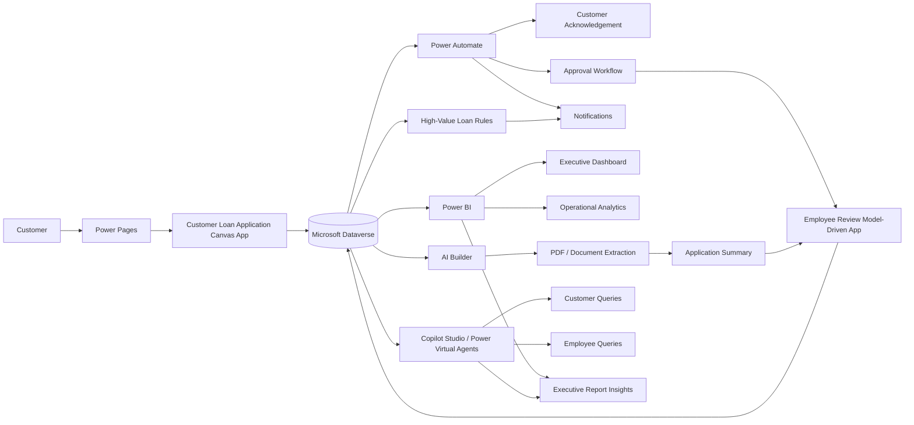
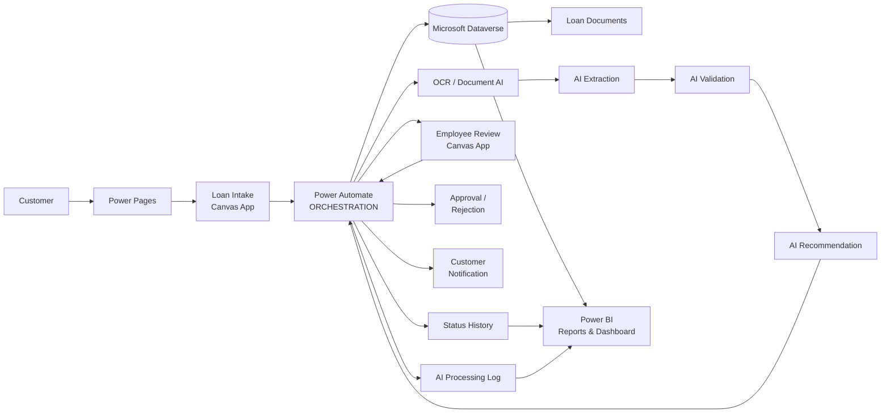
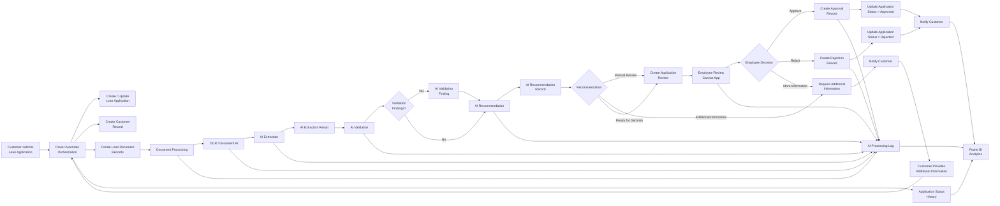

```mermaid
erDiagram
    eipp_customer ||--o{ eipp_loanapplication : "has"
    eipp_loantype ||--o{ eipp_loanapplication : "categorizes"
    
    eipp_loanapplication ||--o{ eipp_loandocuments : "contains"
    eipp_loanapplication ||--o{ eipp_applicationreview : "undergoes"
    eipp_loanapplication ||--o{ eipp_applicationstatushistory : "tracks"
    eipp_loanapplication ||--o{ eipp_approval : "requires"
    eipp_loanapplication ||--o{ eipp_aiconsoildatedoutput : "summarizes"
    eipp_loanapplication ||--o{ eipp_aiprocessinglog : "logs"
    eipp_loanapplication ||--o{ eipp_aivalidationfinding : "validates"
    eipp_loanapplication ||--o{ eipp_airecommendation : "receives"

    eipp_loandocuments ||--o{ eipp_aiextractionresult : "extracts to"
    eipp_loandocuments ||--o{ eipp_aiprocessinglog : "logs"
    
    eipp_aiextractionresult ||--o{ eipp_aivalidationfinding : "sources"
    eipp_aiextractionresult ||--o{ eipp_airecommendation : "feeds"

    eipp_aiconfiguration ||--o{ eipp_aiprocessinglog : "configures"

    eipp_customer {
        uniqueidentifier eipp_customerid PK
        autonumber eipp_customerid_alt "Customer ID"
        string eipp_customername "Primary Name"
        string eipp_firstname
        string eipp_lastname
        string eipp_email
        string eipp_phone
        currency eipp_annualincome
        string eipp_employmentstatus
        string eipp_address
        string eipp_city
        string eipp_provincestate
        string eipp_postalcode
        string eipp_country
    }

    eipp_loantype {
        uniqueidentifier eipp_LoanTypeID PK
        autonumber eipp_Newcolumn "Loan Type ID (Primary)"
        choice eipp_LoanType
        string eipp_Description
    }

    eipp_loanapplication {
        uniqueidentifier eipp_loanapplicationid PK
        autonumber eipp_applicationid "Application ID (Primary)"
        lookup eipp_Customer FK
        lookup eipp_LoanType FK
        choice eipp_applicationstatus
        currency eipp_loanamount
        choice eipp_loantermtype
        string eipp_leanamount_term
        decimal eipp_interestrate
        choice eipp_documentsprovided
        image eipp_applicantsignature
    }

    eipp_loandocuments {
        uniqueidentifier eipp_LoanDocumentGUID PK
        autonumber eipp_DocumentID
        lookup eipp_LoanApplication FK
        string eipp_Newcolumn "Primary Name"
        string eipp_DocumentName
        choice eipp_DocumentType
        choice eipp_DocumentStatus
        choice eipp_AIProcessingStatus
        decimal eipp_AIConfidence
        boolean eipp_ReviewRequired
        file eipp_File
        datetime eipp_UploadDate
    }

    eipp_aiextractionresult {
        uniqueidentifier eipp_AIExtractionResultGUID PK
        autonumber eipp_Newcolumn "Extraction Number (Primary)"
        lookup eipp_LoanDocument FK
        string eipp_AIModel
        decimal eipp_ConfidenceScore
        choice eipp_ExtractionStatus
        multitext eipp_ExtractedData
        multitext eipp_ErrorMessage
        integer eipp_ProcessingDuration
    }

    eipp_aivalidationfinding {
        uniqueidentifier eipp_AIValidationFindingGUID PK
        autonumber eipp_Newcolumn "Finding ID (Primary)"
        lookup eipp_LoanApplication FK
        lookup eipp_AIExtractionResult FK
        string eipp_FieldName
        multitext eipp_ExtractedValue
        multitext eipp_ApplicantValue
        choice eipp_FindingType
        choice eipp_FindingStatus
        choice eipp_Severity
        decimal eipp_ConfidenceScore
        datetime eipp_DetectedOn
    }

    eipp_airecommendation {
        uniqueidentifier eipp_AIRecommendationGUID PK
        autonumber eipp_Newcolumn "Recommendation ID (Primary)"
        lookup eipp_LoanApplication FK
        lookup eipp_AIExtractionResult FK
        choice eipp_Recommendation
        choice eipp_RecommendationType
        choice eipp_RecommendationStatus
        choice eipp_RiskLevel
        decimal eipp_ConfidenceScore
        multitext eipp_Reasoning
        multitext eipp_RecommendationSummary
        choice eipp_ReviewerDecision
    }

    eipp_aiconsoildatedoutput {
        uniqueidentifier eipp_AIConsolidatedOutputGUID PK
        autonumber eipp_Newcolumn "Output ID (Primary)"
        lookup eipp_LoanApplication FK
        multitext eipp_ConsolidatedAIResult
        multitext eipp_KeyFindings
        string eipp_AIRecommendation
        choice eipp_OverallAIAssessment
        choice eipp_ValidationOutcome
        decimal eipp_AIConfidenceScore
    }

    eipp_aiprocessinglog {
        uniqueidentifier eipp_AIProcessingLogGUID PK
        autonumber eipp_Newcolumn "Processing Log ID (Primary)"
        lookup eipp_LoanApplication FK
        lookup eipp_LoanDocument FK
        string eipp_AIModel
        string eipp_ModelVersion
        choice eipp_ProcessingStage
        choice eipp_ProcessingStatus
        integer eipp_ProcessingDuration
        integer eipp_RetryCount
        string eipp_ErrorCode
        multitext eipp_ErrorMessage
    }

    eipp_aiconfiguration {
        uniqueidentifier eipp_AIConfigurationGUID PK
        autonumber eipp_Newcolumn "Configuration ID (Primary)"
        string eipp_ConfigurationName
        string eipp_AIModel
        string eipp_ModelVersion
        choice eipp_AIFunction
        choice eipp_DocumentType
        decimal eipp_ConfidenceThreshold
        boolean eipp_IsActive
        multitext eipp_Instructions
        multitext eipp_ValidationRules
    }

    eipp_applicationreview {
        uniqueidentifier eipp_ApplicationReviewId PK
        autonumber eipp_ReviewID
        lookup eipp_LoanApplication FK
        lookup eipp_Reviewer FK
        choice eipp_ReviewStatus
        choice eipp_ReviewOutcome
        datetime eipp_ReviewStartDate
        datetime eipp_ReviewCompletedDate
        multitext eipp_ReviewerComments
    }

    eipp_applicationstatushistory {
        uniqueidentifier eipp_ApplicationStatusHistory PK
        autonumber eipp_Newcolumn "Status History ID (Primary)"
        lookup eipp_LoanApplication FK
        lookup eipp_ChangedBy FK
        choice eipp_PreviousStatus
        choice eipp_NewStatus
        datetime eipp_StatusDate
        multitext eipp_Comments
    }

    eipp_approval {
        uniqueidentifier eipp_ApprovalId PK
        autonumber eipp_Newcolumn "Approval ID (Primary)"
        autonumber eipp_ApprovalNumber
        lookup eipp_LoanApplication FK
        lookup eipp_Approver FK
        choice eipp_ApprovalStatus
        datetime eipp_SubmittedDate
        datetime eipp_DecisionDate
        multitext eipp_Comments
    }

```

<p align="center">
  
</p


🔗 **Live Dashboard:**
[https://atsuvovor.github.io/power_bi_projects/cyber_attack_insight_dashboard.html](https://atsuvovor.github.io/power_bi_projects/cyber_attack_insight_dashboard.html)

---
## Transforming the Future of Digital Lending

At **EIPPONE**, we are redefining the lending experience through intelligent digital solutions. Our integrated platform brings together **secure online applications, automated approval workflows, real-time application tracking, and interactive business intelligence** to streamline the entire loan lifecycle.

By leveraging **Microsoft Power Platform**, organizations can improve operational efficiency, enhance customer satisfaction, and make faster, data-driven decisions.

### Business Problem

-   Manual paper-based loan applications
-   High processing time and operational effort
-   Data-entry and validation errors
-   Manual document review
-   Limited application-status visibility
-   Delayed customer communication
-   Limited operational and executive analytics

### Solution Objectives

1.  Digitize loan application intake.
2.  Centralize application information and documents in Dataverse.
3.  Validate required information before submission.
4.  Automate acknowledgement, notification, and approval workflows.
5.  Provide employees with a structured review experience.
6.  Allow customers to track application status.
7.  Provide real-time Power BI reporting.
8.  Introduce AI-assisted document extraction, summaries,
    recommendations, and conversational analytics.
9.  Identify high-value applications for enhanced monitoring.
10. Create a scalable foundation for intelligent lending operations.


## 4. Architecture Blueprint

### End-to-End Architecture



### Core Logic

``` text
Customer
   |
   v
Power Pages / Customer Application
   |
   v
Power Apps + Validation
   |
   v
Dataverse
   |
   +----> Power Automate ----> Acknowledgement / Approval / Alerts
   |
   +----> Employee Review App
   |
   +----> AI Builder ----> Extraction / Summary / Recommendation
   |
   +----> Power BI ----> Executive & Operational Analytics
   |
   +----> Copilot Studio ----> Customer & Employee Conversations
```

### System Architecture  

#### Overview

```text
                         EIPPONE LOAN PLATFORM
                                  │
                                  ▼
                           MICROSOFT POWER
                              PLATFORM
                                  │
             ┌────────────────────┼────────────────────┐
             │                    │                    │
             ▼                    ▼                    ▼
          DATAVERSE          POWER AUTOMATE       AI / DOCUMENT
        Data & Relations      Workflows            INTELLIGENCE
             │                    │                    │
             └────────────────────┼────────────────────┘
                                  │
                                  ▼
                           POWER PAGES
                       Web Portal / Experience
                                  │
              ┌───────────────────┼───────────────────┐
              │                   │                   │
              ▼                   ▼                   ▼
        CUSTOMER PORTAL     EMPLOYEE PORTAL      ANALYTICS
              │                   │                   │
              ▼                   ▼                   ▼
       Canvas App #1       Canvas App #3        Power BI
       Loan Intake         Employee Review       Reports/
                                                  Dashboard
              │                   │                   │
              └───────────────────┼───────────────────┘
                                  │
                                  ▼
                             DATAVERSE
```

#### Power Pages - External web experience/container  
```text
POWER PAGES
│
├── Customer Portal
│     ├── Loan Application Intake
│     │      └── Canvas App
│     │
│     └── Client Application View
│            └── Canvas App
│
├── Employee Portal
│     └── Employee Review
│            └── Canvas App
│
└── Analytics
      └── Power BI
             ├── Executive Dashboard
             ├── Loan Portfolio Reports
             ├── Application Analytics
             └── AI/OCR Quality Metrics

```

#### Architecture Detail

```text
                         EIPPONE LOAN PLATFORM
                                  │
                    ┌─────────────┴─────────────┐
                    │                           │
                    ▼                           ▼
              EXPERIENCE LAYER             INTELLIGENCE
                    │                           │
              POWER PAGES                  AI / OCR
                    │                           │
       ┌────────────┼────────────┐              │
       │            │            │              │
       ▼            ▼            ▼              ▼
   Customer      Employee     Analytics    Document AI
   Portal        Portal       Portal       Processing
       │            │            │              │
       ▼            ▼            ▼              │
   Canvas Apps   Canvas App   Power BI          │
       │            │            │              │
       └────────────┴────────────┴──────────────┘
                            │
                            ▼
                         DATAVERSE
                            │
       ┌────────────────────┼────────────────────┐
       │                    │                    │
       ▼                    ▼                    ▼
  Loan Operations       AI Results          Audit/History
       │                    │                    │
       ▼                    ▼                    ▼
 Applications          Extraction          Processing Log
 Customers             Validation           Status History
 Documents             Recommendation       Reviews
 Approvals                                  Approvals
                            │
                            ▼
                      POWER AUTOMATE
                       Orchestration
```


### Mermaid — Power Automate Orchestration

**Power Automate as central  orchestration engine** connecting Dataverse, document processing, AI, notifications, reviews, approvals, and audit history.


#### Overview

For your documentation, I would actually simplify the visual slightly and make **Power Automate the central orchestration engine**:



#### Power Automate Orchestration Detail




### Where Power Automate fits

Architectural definition is:

> **Power Automate — Orchestration Layer:** Coordinates application intake, Dataverse record creation and updates, document processing, AI/OCR execution, validation, recommendations, employee review, approvals, notifications, status tracking, and audit logging.

This is the version I would use in your **EIPPONE Loan Platform architecture documentation**, because it clearly separates:

* **Power Pages** → user/web experience
* **Canvas Apps** → application UI
* **Dataverse** → system of record
* **Power Automate** → orchestration
* **OCR / AI** → intelligence
* **Power BI** → analytics and reporting.


## Choices Structure
```text
Choices
│
├── Document Type
│   ├── Identification
│   ├── Proof of Address
│   ├── Proof of Income
│   ├── Employment Letter
│   ├── Bank Statement
│   ├── Tax Document
│   ├── Financial Statement
│   ├── Credit Report
│   ├── Loan Statement
│   ├── Property Document
│   ├── Purchase Agreement
│   ├── Insurance Document
│   └── Other
│
├── Document Status
│   ├── Required
│   ├── Submitted
│   ├── Under Review
│   ├── Accepted
│   ├── Rejected
│   ├── Needs Correction
│   ├── Expired
│   └── Cancelled
│
├── AI Processing Status
│   ├── Not Started
│   ├── Queued
│   ├── Processing
│   ├── Completed
│   ├── Completed with Findings
│   ├── Failed
│   ├── Requires Human Review
│   └── Skipped
│
├── Application Status
│   ├── Draft
│   ├── Submitted
│   ├── Under Review
│   ├── Pending Information
│   ├── Pending Approval
│   ├── Approved
│   ├── Rejected
│   ├── Withdrawn
│   ├── Cancelled
│   └── Completed
│
├── Review Status
│   ├── Not Started
│   ├── Assigned
│   ├── In Progress
│   ├── Pending Information
│   ├── Completed
│   ├── Escalated
│   └── Cancelled
│
├── Approval Status
│   ├── Not Started
│   ├── Pending Approval
│   ├── In Progress
│   ├── Approved
│   ├── Rejected
│   ├── Returned
│   ├── Cancelled
│   └── Expired
│
└── AI Finding Severity
    ├── Informational
    ├── Low
    ├── Medium
    ├── High
    └── Critical
```
    
## Operational Dataverse model


```text
CUSTOMER
   |
   | 1:N
   v
LOAN APPLICATION
   |
   +--------------------+
   |                    |
   | 1:N                | 1:N
   v                    v
LOAN DOCUMENT       APPLICATION REVIEW
   |
   | 1:N
   v
AI EXTRACTION RESULT


LOAN APPLICATION
   |
   +---- 1:N ---> APPROVAL
   |
   +---- 1:N ---> STATUS HISTORY
   |
   +---- 1:N ---> AI VALIDATION FINDING
   |
   +---- 1:N ---> AI RECOMMENDATION
   |
   +---- 1:N ---> AI PROCESSING LOG


LOAN TYPE
   |
   | 1:N
   v
LOAN APPLICATION              

```

## Target AI Architecture

I recommend evolving your existing platform into this architecture:

```text
                         LOAN APPLICATION DIGITALIZATION
                                      PLATFORM
                                            |
                 +--------------------------+--------------------------+
                 |                          |                          |
                 v                          v                          v
        CUSTOMER EXPERIENCE         EMPLOYEE EXPERIENCE        EXECUTIVE EXPERIENCE
                 |                          |                          |
          Power Pages                Model-Driven App             Power BI
                 |                          |                          |
                 v                          v                          v
        Customer Copilot          Employee Copilot              AI Insights
                 |                          |                          |
                 +--------------------------+--------------------------+
                                            |
                                            v
                                  COPILOT STUDIO
                                  AI ORCHESTRATION
                                            |
                    +-----------------------+-----------------------+
                    |                       |                       |
                    v                       v                       v
                Dataverse             Power Automate           Power BI
             Operational Data          Business Logic         Semantic Model
                    |                       |
                    |                       |
                    v                       v
             Loan Applications       Approval Workflow
             Documents               Notifications
             Reviews                 Alerts
             AI Results
                    |
                    v
               AI BUILDER
          Document Intelligence
                    |
                    v
          PDF / ID / Income / Tax
             / Supporting Docs
```
# Loan Digitalisation Platform — Dataverse Schema Documentation

This document provides complete, GitHub-ready documentation for all Dataverse entities in the **EIPPONE Loan Platform** solution.

---

## 1. System Architecture & Entity Relationships


---

## 2. Core Domain Data Dictionary

**Table: Customer**

**Logical Name:** `eipp_customer`

**Description:** Stores applicant profile, personal identification, contact details, and self-reported financial indicators.

| Display Name | Schema / Logical Name | Data Type | Required | Searchable | Description |
| --- | --- | --- | --- | --- | --- |
| **Address** | `eipp_address` | Multiple lines of text | No | Yes | Full street address of applicant. |
| **Annual Income** | `eipp_annualincome` | Currency | Yes | Yes | Total annual income reported. |
| **Annual Income (Base)** | `eipp_annualincome_base` | Currency | No | Yes | Base currency conversion field. |
| **City** | `eipp_city` | Single line of text | No | Yes | City location. |
| **Country** | `eipp_country` | Single line of text | No | Yes | Country of residence. |
| **Created Date** | `eipp_createddate` | Date and time | No | Yes | Record creation timestamp. |
| **Customer** | `eipp_customerid` | Unique identifier | Yes | Yes | Primary key GUID. |
| **Customer ID** | `eipp_customerid` | Autonumber | Yes | Yes | Unique reference identifier. |
| **Customer Name** *(Primary)* | `eipp_customername` | Single line of text | No | Yes | Full display name. |
| **Email** | `eipp_email` | Single line of text | No | Yes | Primary email contact. |
| **Employment Status** | `eipp_employmentstatus` | Single line of text | No | Yes | Employment condition indicator. |
| **First Name** | `eipp_firstname` | Single line of text | No | Yes | First name. |
| **Last Name** | `eipp_lastname` | Single line of text | No | Yes | Last / Surname. |
| **Modified Date** | `eipp_modifieddate` | Date and time | No | Yes | Last modified timestamp. |
| **Phone** | `eipp_phone` | Single line of text | No | Yes | Contact phone number. |
| **Postal Code** | `eipp_postalcode` | Single line of text | No | Yes | Postal / ZIP code. |
| **Province/State** | `eipp_provincestate` | Choice | No | Yes | Geographic region lookup. |

---

**Table: Loan Type**

**Logical Name:** `eipp_loantype`

**Description:** Lookup entity defining loan product types offered on the platform.

| Display Name | Schema / Logical Name | Data Type | Required | Searchable | Description |
| --- | --- | --- | --- | --- | --- |
| **Description** | `eipp_Description` | Single line of text | No | Yes | Detail on product conditions. |
| **Loan Type** | `eipp_LoanType` | Choice | No | Yes | Categorization choice. |
| **Loan Type 1ID** | `eipp_LoanTypeID` | Unique identifier | Yes | Yes | Primary key GUID. |
| **Loan Type ID** *(Primary)* | `eipp_Newcolumn` | Autonumber | Yes | Yes | Record lookup display reference. |

---

**Table: Loan Application**

**Logical Name:** `eipp_loanapplication`

**Description:** Central application entity containing submission data, terms requested, and progress indicators.

| Display Name | Schema / Logical Name | Data Type | Required | Searchable | Description |
| --- | --- | --- | --- | --- | --- |
| **Application ID** *(Primary)* | `eipp_applicationid` | Autonumber | Yes | Yes | System-assigned primary ID. |
| **Loan Application** | `eipp_loanapplicationid` | Unique identifier | Yes | Yes | Primary key GUID. |
| **Customer** | `eipp_Customer` | Lookup | Yes | Yes | Foreign key to Customer entity. |
| **Loan Type (Lookup)** | `eipp_LoanType` | Lookup | No | Yes | Reference to selected Loan Type. |
| **Loan Amount** | `eipp_loanamount` | Currency | Yes | Yes | Requested loan total. |
| **Loan Amount (Base)** | `eipp_loanamount_base` | Currency | No | Yes | Base currency conversion field. |
| **Loan Amount Term** | `eipp_leanamount_term` | Choice | No | Yes | Repayment interval classification. |
| **Loan Term** | `eipp_leanamount` | Single line of text | No | Yes | Term period text representation. |
| **Loan Term New** | `eipp_leanamountnew` | Choice | No | Yes | Standardized term selection code. |
| **Interest Rate** | `eipp_interestrate` | Decimal | No | Yes | Applied annual interest rate percentage. |
| **Application Status** | `eipp_applicationstatus` | Choice | No | Yes | Current application lifecycle state. |
| **Documents Provided** | `eipp_documentsprovided` | Choice | No | Yes | Mandatory document completion status. |
| **Applicant Signature** | `eipp_applicantsignature` | Image | No | No | Electronic signature capture file. |
| **Annual Income** | `eipp_annualincome` | Currency | No | Yes | Application-level income baseline. |
| **Credit Score** | `eipp_creditscore` | Whole number | No | Yes | Applicant bureau credit score. |
| **Approver Name** | `eipp_approvername` | Lookup | No | Yes | Assigned underwriter reference. |
| **Approver Email** | `eipp_approveremail` | Email | No | Yes | Contact email of approver. |
| **Approver Position** | `eipp_approverposition` | Single line of text | No | Yes | Approver role title. |

---

**Table: Loan Documents**

**Logical Name:** `eipp_loandocuments`

**Description:** Tracks submitted physical files, document classifications, and automated processing flags.

| Display Name | Schema / Logical Name | Data Type | Required | Searchable | Description |
| --- | --- | --- | --- | --- | --- |
| **AI Confidence** | `eipp_AIConfidence` | Decimal | No | Yes | Aggregated document extraction confidence. |
| **AI Processing Status** | `eipp_AIProcessingStatus` | Choice | Yes | Yes | Stage of AI document processing pipeline. |
| **Document ID** | `eipp_DocumentID` | Autonumber | Yes | Yes | Unique ID for document identification. |
| **Document Name** | `eipp_DocumentName` | Single line of text | No | Yes | Descriptive title of uploaded file. |
| **Document Status** | `eipp_DocumentStatus` | Choice | No | Yes | Verification status of document. |
| **Document Type** | `eipp_DocumentType` | Choice | Yes | Yes | Document taxonomy (e.g., Paystub, Passport). |
| **File** | `eipp_File` | File | Yes | No | Encrypted file storage target. |
| **Loan Application** | `eipp_LoanApplication` | Lookup | Yes | Yes | Parent Loan Application reference. |
| **Loan Document GUID** | `eipp_LoanDocumentGUID` | Unique identifier | Yes | Yes | Primary key GUID. |
| **New column** *(Primary)* | `eipp_Newcolumn` | Single line of text | No | Yes | Primary display reference column. |
| **Review Required** | `eipp_ReviewRequired` | Yes/no | Yes | Yes | Flag requesting human underwriter audit. |
| **Upload Date** | `eipp_UploadDate` | Date and time | Yes | Yes | Timestamp of document upload. |

---

## 3. Intelligence & Automation Data Dictionary

**Table: AI Configuration**

**Logical Name:** `eipp_aiconfiguration`

**Description:** Runtime registry for dynamic prompts, model parameters, target function definitions, and execution rules.

| Display Name | Schema / Logical Name | Data Type | Required | Searchable | Description |
| --- | --- | --- | --- | --- | --- |
| **AI Configuration GUID** | `eipp_AIConfigurationGUID` | Unique identifier | Yes | Yes | Primary key GUID. |
| **AI Configuration ID** *(Primary)* | `eipp_Newcolumn` | Autonumber | No | Yes | Auto-increment primary label. |
| **AI Function** | `eipp_AIFunction` | Choice | No | Yes | Automation task type classification. |
| **AI Model** | `eipp_AIModel` | Single line of text | No | Yes | Deployment model identifier (e.g., GPT-4, Document Intelligence). |
| **Confidence Threshold** | `eipp_ConfidenceThreshold` | Decimal | No | Yes | Minimum acceptable auto-approval score. |
| **Configuration Name** | `eipp_ConfigurationName` | Single line of text | No | Yes | Descriptive label of profile settings. |
| **Configuration Version** | `eipp_ConfigurationVersion` | Single line of text | No | Yes | Configuration release version tracker. |
| **Document Type** | `eipp_DocumentType` | Choice | No | Yes | Applicable document target choice. |
| **Effective From** | `eipp_EffectiveFrom` | Date and time | No | Yes | Valid date range opening. |
| **Effective To** | `eipp_EffectiveTo` | Date and time | No | Yes | Expiration timestamp for config rules. |
| **Instructions** | `eipp_Instructions` | Multiple lines of text | No | Yes | Directives / system prompts fed into models. |
| **Is Active** | `eipp_IsActive` | Yes/no | No | Yes | Active status toggle for routing logic. |
| **Model Version** | `eipp_ModelVersion` | Single line of text | No | Yes | Model engine version identifier. |
| **Notes** | `eipp_Notes` | Multiple lines of text | No | Yes | Operational context and documentation. |
| **Validation Rules** | `eipp_ValidationRules` | Multiple lines of text | No | Yes | Custom assertion expressions evaluated against inputs. |

---

**Table: AI Extraction Result**

**Logical Name:** `eipp_aiextractionresult`

**Description:** Persists output structures, raw metadata, performance scores, and error output from AI document analysis runs.

| Display Name | Schema / Logical Name | Data Type | Required | Searchable | Description |
| --- | --- | --- | --- | --- | --- |
| **AI Extraction Result GUID** | `eipp_AIExtractionResultGUID` | Unique identifier | Yes | Yes | Primary key GUID. |
| **AI Extraction Result Number** *(Primary)* | `eipp_Newcolumn` | Autonumber | No | Yes | Primary key display identifier. |
| **AI Model** | `eipp_AIModel` | Single line of text | No | Yes | Engine name used during parse. |
| **Confidence Score** | `eipp_ConfidenceScore` | Decimal | No | Yes | System extraction confidence metric. |
| **Created By** | `eipp_CreatedBy` | Lookup | No | Yes | Execution principal record owner. |
| **Created On** | `eipp_CreatedOn` | Date and time | No | Yes | Record creation timestamp. |
| **Error Message** | `eipp_ErrorMessage` | Multiple lines of text | No | Yes | Extraction stack traces or error logs. |
| **Extracted Data** | `eipp_ExtractedData` | Multiple lines of text | No | Yes | Raw JSON schema payload of findings. |
| **Extraction Date** | `eipp_ExtractionDate` | Date and time | No | Yes | Execution completion timestamp. |
| **Extraction Status** | `eipp_ExtractionStatus` | Choice | No | Yes | Outcome condition (e.g., Success, Failed). |
| **Extraction Version** | `eipp_ExtractionVersion` | Single line of text | No | Yes | Extraction schema version designation. |
| **Loan Document** | `eipp_LoanDocument` | Lookup | No | Yes | Foreign key to target document entity. |
| **Modified By** | `eipp_ModifiedBy` | Lookup | No | Yes | User or process modifying record. |
| **Modified On** | `eipp_ModifiedOn` | Date and time | No | Yes | Record last modified timestamp. |
| **Processing Duration** | `eipp_ProcessingDuration` | Whole number | No | Yes | Parse runtime duration (ms). |

---

**Table: AI Validation Finding**

**Logical Name:** `eipp_aivalidationfinding`

**Description:** Contains discrepancy checks validating extracted data against application inputs.

| Display Name | Schema / Logical Name | Data Type | Required | Searchable | Description |
| --- | --- | --- | --- | --- | --- |
| **AI Extraction Result** | `eipp_AIExtractionResult` | Lookup | No | Yes | Foreign key to source extraction result. |
| **AI Validation Finding GUID** | `eipp_AIValidationFindingGUID` | Unique identifier | Yes | Yes | Primary key GUID. |
| **AI Validation Finding ID** *(Primary)* | `eipp_Newcolumn` | Autonumber | No | Yes | Display key for identification. |
| **Applicant Value** | `eipp_ApplicantValue` | Multiple lines of text | No | Yes | Value supplied by application form. |
| **Confidence Score** | `eipp_ConfidenceScore` | Decimal | No | Yes | Confidence score of validation match. |
| **Detected On** | `eipp_DetectedOn` | Date and time | No | Yes | Mismatch detection timestamp. |
| **Extracted Value** | `eipp_ExtractedValue` | Multiple lines of text | No | Yes | Value found by AI in document. |
| **Field Name** | `eipp_FieldName` | Single line of text | No | Yes | Target attribute validated. |
| **Finding Description** | `eipp_FindingDescription` | Multiple lines of text | No | Yes | Detailed report of rule condition breach. |
| **Finding Status** | `eipp_FindingStatus` | Choice | No | Yes | Verification state (Open, Resolved, Ignored). |
| **Finding Type** | `eipp_FindingType` | Choice | No | Yes | Mismatch category indicator. |
| **Loan Application** | `eipp_LoanApplication` | Lookup | No | Yes | Parent application foreign key. |
| **Resolution Notes** | `eipp_ResolutionNotes` | Multiple lines of text | No | Yes | Manual review resolution comments. |
| **Resolved On** | `eipp_ResolvedOn` | Date and time | No | Yes | Finding resolution timestamp. |
| **Severity** | `eipp_Severity` | Choice | No | Yes | Mismatch impact degree (Low, High, Critical). |

---

**Table: AI Recommendation**

**Logical Name:** `eipp_airecommendation`

**Description:** Records machine learning recommendations, decision rationales, and human sign-off determinations.

| Display Name | Schema / Logical Name | Data Type | Required | Searchable | Description |
| --- | --- | --- | --- | --- | --- |
| **AI Extraction Result** | `eipp_AIExtractionResult` | Lookup | No | Yes | Link to document payload source. |
| **AI Recommendation GUID** | `eipp_AIRecommendationGUID` | Unique identifier | Yes | Yes | Primary key GUID. |
| **AI Recommendation ID** *(Primary)* | `eipp_Newcolumn` | Autonumber | No | Yes | Auto-increment lookup identifier. |
| **Confidence Score** | `eipp_ConfidenceScore` | Decimal | No | Yes | Statistical confidence of recommendation. |
| **Generated On** | `eipp_GeneratedOn` | Date and time | No | Yes | Timestamp decision generated. |
| **Loan Application** | `eipp_LoanApplication` | Lookup | No | Yes | Parent loan application reference. |
| **Reasoning** | `eipp_Reasoning` | Multiple lines of text | No | Yes | AI justification text output. |
| **Recommendation** | `eipp_Recommendation` | Choice | No | Yes | Primary outcome (Approve, Deny, Review). |
| **Recommendation Status** | `eipp_RecommendationStatus` | Choice | No | Yes | Lifecycle status of recommendation. |
| **Recommendation Summary** | `eipp_RecommendationSummary` | Multiple lines of text | No | Yes | Concise executive summary of result. |
| **Recommendation Type** | `eipp_RecommendationType` | Choice | No | Yes | Sub-type classification code. |
| **Reviewed On** | `eipp_ReviewedOn` | Date and time | No | Yes | Timestamp of underwriter assessment. |
| **Reviewer Comments** | `eipp_ReviewerComments` | Multiple lines of text | No | Yes | Human-in-the-loop audit notes. |
| **Reviewer Decision** | `eipp_ReviewerDecision` | Choice | No | Yes | Underwriter override/accept action. |
| **Risk Level** | `eipp_RiskLevel` | Choice | No | Yes | Calculated risk tier (Low, Medium, High). |

---

**Table: AI Consolidated Output**

**Logical Name:** `eipp_aiconsoildatedoutput`

**Description:** High-level summary entity aggregating document intelligence outputs and overall validation metrics for an application.

| Display Name | Schema / Logical Name | Data Type | Required | Searchable | Description |
| --- | --- | --- | --- | --- | --- |
| **AI Confidence Score** | `eipp_AIConfidenceScore` | Decimal | No | Yes | Consolidated confidence overall. |
| **AI Consolidated Output GUID** | `eipp_AIConsolidatedOutputGUID` | Unique identifier | Yes | Yes | Primary key GUID. |
| **AI Consolidated Output ID** *(Primary)* | `eipp_Newcolumn` | Autonumber | No | Yes | Unique lookup reference ID. |
| **AI Processing Run ID** | `eipp_AIProcessingRunID` | Lookup | No | Yes | Direct reference to execution run logs. |
| **AI Recommendation** | `eipp_AIRecommendation` | Single line of text | No | Yes | Aggregated recommendation message. |
| **Consolidated AI Result** | `eipp_ConsolidatedAIResult` | Multiple lines of text | No | Yes | Full combined output payload. |
| **Created By** | `eipp_CreatedBy` | Lookup | No | Yes | Record creator lookup. |
| **Created On** | `eipp_CreatedOn` | Date and time | No | Yes | Record creation timestamp. |
| **Key Findings** | `eipp_KeyFindings` | Multiple lines of text | No | Yes | Highlighted findings summary list. |
| **Loan Application** | `eipp_LoanApplication` | Lookup | No | Yes | Parent loan application key. |
| **Modified By** | `eipp_ModifiedBy` | Lookup | No | Yes | Last updater principal reference. |
| **Modified On** | `eipp_ModifiedOn` | Date and time | No | Yes | Record modification timestamp. |
| **Output Date** | `eipp_OutputDate` | Date and time | No | Yes | Generation timestamp. |
| **Output Version** | `eipp_OutputVersion` | Whole number | No | Yes | Incremental output version tracker. |
| **Overall AI Assessment** | `eipp_OverallAIAssessment` | Choice | No | Yes | System decision assessment. |
| **Processing Duration** | `eipp_ProcessingDuration` | Whole number | No | Yes | Total pipeline runtime (ms). |
| **Validation Outcome** | `eipp_ValidationOutcome` | Choice | No | Yes | Final validation gate status. |

---

**Table: AI Processing Log**

**Logical Name:** `eipp_aiprocessinglog`

**Description:** Low-level execution log capturing performance metrics, stage progress, errors, and retry attempts across pipelines.

| Display Name | Schema / Logical Name | Data Type | Required | Searchable | Description |
| --- | --- | --- | --- | --- | --- |
| **AI Model** | `eipp_AIModel` | Single line of text | No | Yes | Execution model identification. |
| **AI Processing Log GUID** | `eipp_AIProcessingLogGUID` | Unique identifier | Yes | Yes | Primary key GUID. |
| **AI Processing Log ID** *(Primary)* | `eipp_Newcolumn` | Autonumber | No | Yes | Auto-increment log entry reference. |
| **Error Code** | `eipp_ErrorCode` | Single line of text | No | Yes | Categorized system exception identifier. |
| **Error Message** | `eipp_ErrorMessage` | Multiple lines of text | No | Yes | Exception error details. |
| **Input Reference** | `eipp_InputReference` | Multiple lines of text | No | Yes | Pointer or key for execution input data. |
| **Loan Application** | `eipp_LoanApplication` | Lookup | No | Yes | Associated loan application key. |
| **Loan Document** | `eipp_LoanDocument` | Lookup | No | Yes | Associated target document key. |
| **Model Version** | `eipp_ModelVersion` | Single line of text | No | Yes | Deployed model release tag. |
| **Output Reference** | `eipp_OutputReference` | Multiple lines of text | No | Yes | Reference pointer for output target. |
| **Processing Duration** | `eipp_ProcessingDuration` | Whole number | No | Yes | Execution time span measurement. |
| **Processing End** | `eipp_ProcessingEnd` | Date and time | No | Yes | Pipeline end time. |
| **Processing Stage** | `eipp_ProcessingStage` | Choice | No | Yes | Active stage (Parse, Validate, Score). |
| **Processing Start** | `eipp_ProcessingStart` | Date and time | No | Yes | Pipeline start time. |
| **Processing Status** | `eipp_ProcessingStatus` | Choice | No | Yes | Execution state (Running, Failed, Pass). |
| **Retry Count** | `eipp_RetryCount` | Whole number | No | Yes | Number of re-execution attempts. |

---

## 4. Governance & Operations Data Dictionary

**Table: Application Review**

**Logical Name:** `eipp_applicationreview`

**Description:** Manages manual underwriting activities, review timelines, assignees, and decision comments.

| Display Name | Schema / Logical Name | Data Type | Required | Searchable | Description |
| --- | --- | --- | --- | --- | --- |
| **Application Review** | `eipp_ApplicationReviewId` | Unique identifier | Yes | Yes | Primary key GUID. |
| **Loan Application** | `eipp_LoanApplication` | Lookup | No | Yes | Parent loan application key. |
| **New column** *(Primary)* | `eipp_Newcolumn` | Single line of text | No | Yes | Primary display text identifier. |
| **Review Completed Date** | `eipp_ReviewCompletedDate` | Date and time | No | Yes | Audit sign-off completion date. |
| **Review ID** | `eipp_ReviewID` | Autonumber | Yes | Yes | Unique review task tracking code. |
| **Review Outcome** | `eipp_ReviewOutcome` | Choice | No | Yes | Manual review resolution decision. |
| **Review Start Date** | `eipp_ReviewStartDate` | Date and time | No | Yes | Task initiation date. |
| **Review Status** | `eipp_ReviewStatus` | Choice | No | Yes | Current task state (In Progress, Closed). |
| **Reviewer** | `eipp_Reviewer` | Lookup | No | Yes | Assigned underwriter reference. |
| **Reviewer Comments** | `eipp_ReviewerComments` | Multiple lines of text | No | Yes | Detailed underwriter notes. |

---

**Table: Application Status History**

**Logical Name:** `eipp_applicationstatushistory`

**Description:** Immutable state machine event log recording lifecycle status updates.

| Display Name | Schema / Logical Name | Data Type | Required | Searchable | Description |
| --- | --- | --- | --- | --- | --- |
| **Application Status History** | `eipp_ApplicationStatusHistory` | Unique identifier | Yes | Yes | Primary key GUID. |
| **Changed By** | `eipp_ChangedBy` | Lookup | No | Yes | Actor or service making status change. |
| **Comments** | `eipp_Comments` | Multiple lines of text | No | Yes | State transition reason or notes. |
| **Loan Application** | `eipp_LoanApplication` | Lookup | No | Yes | Related Loan Application key. |
| **New Status** | `eipp_NewStatus` | Choice | No | Yes | Target state transition output. |
| **Previous Status** | `eipp_PreviousStatus` | Choice | No | Yes | Source state transition input. |
| **Status Date** | `eipp_StatusDate` | Date and time | No | Yes | Transition timestamp. |
| **Status History ID** *(Primary)* | `eipp_Newcolumn` | Autonumber | No | Yes | Unique status event auto-number. |

---

**Table: Approval**

**Logical Name:** `eipp_approval`

**Description:** Tracks credit approval authority workflows, sign-off requests, and formal authorization events.

| Display Name | Schema / Logical Name | Data Type | Required | Searchable | Description |
| --- | --- | --- | --- | --- | --- |
| **Approval** | `eipp_ApprovalId` | Unique identifier | Yes | Yes | Primary key GUID. |
| **Approval ID** *(Primary)* | `eipp_Newcolumn` | Autonumber | No | Yes | System lookup display ID. |
| **Approval Number** | `eipp_ApprovalNumber` | Autonumber | No | Yes | Auto-sequenced approval tracking ID. |
| **Approval Status** | `eipp_ApprovalStatus` | Choice | No | Yes | Decision state (Pending, Approved). |
| **Approver** | `eipp_Approver` | Lookup | No | Yes | Approving user or group reference. |
| **Comments** | `eipp_Comments` | Multiple lines of text | No | Yes | Approver notes and conditions. |
| **Decision Date** | `eipp_DecisionDate` | Date and time | No | Yes | Sign-off or rejection timestamp. |
| **Loan Application** | `eipp_LoanApplication` | Lookup | No | Yes | Target Loan Application key. |
| **Submitted Date** | `eipp_SubmittedDate` | Date and time | No | Yes | Date approval request was issued. |

## Fabric model

```text
                         DIM_DATE
                            |
                            |
                   +--------+--------+
                   |                 |
                   v                 v
           FACT_LOAN_APPLICATION   FACT_APPROVAL
                   |
                   |
                   v
             DIM_CUSTOMER
                   |
                   |
                   v
              DIM_LOAN
                   |
                   |
                   v
              DIM_STATUS


             FACT_DOCUMENT_PROCESSING
                       |
                       +---- DIM_DOCUMENT
                       |
                       +---- DIM_DATE
                       |
                       +---- DIM_APPLICATION


                  FACT_AI_REVIEW
                       |
                       +---- DIM_APPLICATION
                       +---- DIM_AI_MODEL
                       +---- DIM_DATE


              FACT_APPLICATION_STATUS
                       |
                       +---- DIM_STATUS
                       +---- DIM_DATE
                       +---- DIM_APPLICATION

```

## Moving the Dataverse data into Fabric

We will use Fabric's Data Factory capabilities, pipelines, Dataflows Gen2, shortcuts, notebooks, or other ingestion patterns depending on the developement environment and scale.

```text
Dataverse
    |
    v
Fabric ingestion
    |
    v
Bronze/raw data
    |
    v
Transformation
    |
    v
Silver/curated data
    |
    v
Gold/star schema
    |
    v
Power BI semantic model
```

# Loan Digitalisation Platform — Dataverse Schema Documentation

This document provides complete, GitHub-ready documentation for all Dataverse entities in the **EIPPONE Loan Platform** solution.

---

## 1. System Architecture & Entity Relationships



---

## 2. Core Domain Data Dictionary

**Table: Customer**

**Logical Name:** `eipp_customer`

**Description:** Stores applicant profile, personal identification, contact details, and self-reported financial indicators.

| Display Name | Schema / Logical Name | Data Type | Required | Searchable | Description |
| --- | --- | --- | --- | --- | --- |
| **Address** | `eipp_address` | Multiple lines of text | No | Yes | Full street address of applicant. |
| **Annual Income** | `eipp_annualincome` | Currency | Yes | Yes | Total annual income reported. |
| **Annual Income (Base)** | `eipp_annualincome_base` | Currency | No | Yes | Base currency conversion field. |
| **City** | `eipp_city` | Single line of text | No | Yes | City location. |
| **Country** | `eipp_country` | Single line of text | No | Yes | Country of residence. |
| **Created Date** | `eipp_createddate` | Date and time | No | Yes | Record creation timestamp. |
| **Customer** | `eipp_customerid` | Unique identifier | Yes | Yes | Primary key GUID. |
| **Customer ID** | `eipp_customerid` | Autonumber | Yes | Yes | Unique reference identifier. |
| **Customer Name** *(Primary)* | `eipp_customername` | Single line of text | No | Yes | Full display name. |
| **Email** | `eipp_email` | Single line of text | No | Yes | Primary email contact. |
| **Employment Status** | `eipp_employmentstatus` | Single line of text | No | Yes | Employment condition indicator. |
| **First Name** | `eipp_firstname` | Single line of text | No | Yes | First name. |
| **Last Name** | `eipp_lastname` | Single line of text | No | Yes | Last / Surname. |
| **Modified Date** | `eipp_modifieddate` | Date and time | No | Yes | Last modified timestamp. |
| **Phone** | `eipp_phone` | Single line of text | No | Yes | Contact phone number. |
| **Postal Code** | `eipp_postalcode` | Single line of text | No | Yes | Postal / ZIP code. |
| **Province/State** | `eipp_provincestate` | Choice | No | Yes | Geographic region lookup. |

---

**Table: Loan Type**

**Logical Name:** `eipp_loantype`

**Description:** Lookup entity defining loan product types offered on the platform.

| Display Name | Schema / Logical Name | Data Type | Required | Searchable | Description |
| --- | --- | --- | --- | --- | --- |
| **Description** | `eipp_Description` | Single line of text | No | Yes | Detail on product conditions. |
| **Loan Type** | `eipp_LoanType` | Choice | No | Yes | Categorization choice. |
| **Loan Type 1ID** | `eipp_LoanTypeID` | Unique identifier | Yes | Yes | Primary key GUID. |
| **Loan Type ID** *(Primary)* | `eipp_Newcolumn` | Autonumber | Yes | Yes | Record lookup display reference. |

---

**Table: Loan Application**

**Logical Name:** `eipp_loanapplication`

**Description:** Central application entity containing submission data, terms requested, and progress indicators.

| Display Name | Schema / Logical Name | Data Type | Required | Searchable | Description |
| --- | --- | --- | --- | --- | --- |
| **Application ID** *(Primary)* | `eipp_applicationid` | Autonumber | Yes | Yes | System-assigned primary ID. |
| **Loan Application** | `eipp_loanapplicationid` | Unique identifier | Yes | Yes | Primary key GUID. |
| **Customer** | `eipp_Customer` | Lookup | Yes | Yes | Foreign key to Customer entity. |
| **Loan Type (Lookup)** | `eipp_LoanType` | Lookup | No | Yes | Reference to selected Loan Type. |
| **Loan Amount** | `eipp_loanamount` | Currency | Yes | Yes | Requested loan total. |
| **Loan Amount (Base)** | `eipp_loanamount_base` | Currency | No | Yes | Base currency conversion field. |
| **Loan Amount Term** | `eipp_leanamount_term` | Choice | No | Yes | Repayment interval classification. |
| **Loan Term** | `eipp_leanamount` | Single line of text | No | Yes | Term period text representation. |
| **Loan Term New** | `eipp_leanamountnew` | Choice | No | Yes | Standardized term selection code. |
| **Interest Rate** | `eipp_interestrate` | Decimal | No | Yes | Applied annual interest rate percentage. |
| **Application Status** | `eipp_applicationstatus` | Choice | No | Yes | Current application lifecycle state. |
| **Documents Provided** | `eipp_documentsprovided` | Choice | No | Yes | Mandatory document completion status. |
| **Applicant Signature** | `eipp_applicantsignature` | Image | No | No | Electronic signature capture file. |
| **Annual Income** | `eipp_annualincome` | Currency | No | Yes | Application-level income baseline. |
| **Credit Score** | `eipp_creditscore` | Whole number | No | Yes | Applicant bureau credit score. |
| **Approver Name** | `eipp_approvername` | Lookup | No | Yes | Assigned underwriter reference. |
| **Approver Email** | `eipp_approveremail` | Email | No | Yes | Contact email of approver. |
| **Approver Position** | `eipp_approverposition` | Single line of text | No | Yes | Approver role title. |

---

**Table: Loan Documents**

**Logical Name:** `eipp_loandocuments`

**Description:** Tracks submitted physical files, document classifications, and automated processing flags.

| Display Name | Schema / Logical Name | Data Type | Required | Searchable | Description |
| --- | --- | --- | --- | --- | --- |
| **AI Confidence** | `eipp_AIConfidence` | Decimal | No | Yes | Aggregated document extraction confidence. |
| **AI Processing Status** | `eipp_AIProcessingStatus` | Choice | Yes | Yes | Stage of AI document processing pipeline. |
| **Document ID** | `eipp_DocumentID` | Autonumber | Yes | Yes | Unique ID for document identification. |
| **Document Name** | `eipp_DocumentName` | Single line of text | No | Yes | Descriptive title of uploaded file. |
| **Document Status** | `eipp_DocumentStatus` | Choice | No | Yes | Verification status of document. |
| **Document Type** | `eipp_DocumentType` | Choice | Yes | Yes | Document taxonomy (e.g., Paystub, Passport). |
| **File** | `eipp_File` | File | Yes | No | Encrypted file storage target. |
| **Loan Application** | `eipp_LoanApplication` | Lookup | Yes | Yes | Parent Loan Application reference. |
| **Loan Document GUID** | `eipp_LoanDocumentGUID` | Unique identifier | Yes | Yes | Primary key GUID. |
| **New column** *(Primary)* | `eipp_Newcolumn` | Single line of text | No | Yes | Primary display reference column. |
| **Review Required** | `eipp_ReviewRequired` | Yes/no | Yes | Yes | Flag requesting human underwriter audit. |
| **Upload Date** | `eipp_UploadDate` | Date and time | Yes | Yes | Timestamp of document upload. |

---

## 3. Intelligence & Automation Data Dictionary

**Table: AI Configuration**

**Logical Name:** `eipp_aiconfiguration`

**Description:** Runtime registry for dynamic prompts, model parameters, target function definitions, and execution rules.

| Display Name | Schema / Logical Name | Data Type | Required | Searchable | Description |
| --- | --- | --- | --- | --- | --- |
| **AI Configuration GUID** | `eipp_AIConfigurationGUID` | Unique identifier | Yes | Yes | Primary key GUID. |
| **AI Configuration ID** *(Primary)* | `eipp_Newcolumn` | Autonumber | No | Yes | Auto-increment primary label. |
| **AI Function** | `eipp_AIFunction` | Choice | No | Yes | Automation task type classification. |
| **AI Model** | `eipp_AIModel` | Single line of text | No | Yes | Deployment model identifier (e.g., GPT-4, Document Intelligence). |
| **Confidence Threshold** | `eipp_ConfidenceThreshold` | Decimal | No | Yes | Minimum acceptable auto-approval score. |
| **Configuration Name** | `eipp_ConfigurationName` | Single line of text | No | Yes | Descriptive label of profile settings. |
| **Configuration Version** | `eipp_ConfigurationVersion` | Single line of text | No | Yes | Configuration release version tracker. |
| **Document Type** | `eipp_DocumentType` | Choice | No | Yes | Applicable document target choice. |
| **Effective From** | `eipp_EffectiveFrom` | Date and time | No | Yes | Valid date range opening. |
| **Effective To** | `eipp_EffectiveTo` | Date and time | No | Yes | Expiration timestamp for config rules. |
| **Instructions** | `eipp_Instructions` | Multiple lines of text | No | Yes | Directives / system prompts fed into models. |
| **Is Active** | `eipp_IsActive` | Yes/no | No | Yes | Active status toggle for routing logic. |
| **Model Version** | `eipp_ModelVersion` | Single line of text | No | Yes | Model engine version identifier. |
| **Notes** | `eipp_Notes` | Multiple lines of text | No | Yes | Operational context and documentation. |
| **Validation Rules** | `eipp_ValidationRules` | Multiple lines of text | No | Yes | Custom assertion expressions evaluated against inputs. |

---

**Table: AI Extraction Result**

**Logical Name:** `eipp_aiextractionresult`

**Description:** Persists output structures, raw metadata, performance scores, and error output from AI document analysis runs.

| Display Name | Schema / Logical Name | Data Type | Required | Searchable | Description |
| --- | --- | --- | --- | --- | --- |
| **AI Extraction Result GUID** | `eipp_AIExtractionResultGUID` | Unique identifier | Yes | Yes | Primary key GUID. |
| **AI Extraction Result Number** *(Primary)* | `eipp_Newcolumn` | Autonumber | No | Yes | Primary key display identifier. |
| **AI Model** | `eipp_AIModel` | Single line of text | No | Yes | Engine name used during parse. |
| **Confidence Score** | `eipp_ConfidenceScore` | Decimal | No | Yes | System extraction confidence metric. |
| **Created By** | `eipp_CreatedBy` | Lookup | No | Yes | Execution principal record owner. |
| **Created On** | `eipp_CreatedOn` | Date and time | No | Yes | Record creation timestamp. |
| **Error Message** | `eipp_ErrorMessage` | Multiple lines of text | No | Yes | Extraction stack traces or error logs. |
| **Extracted Data** | `eipp_ExtractedData` | Multiple lines of text | No | Yes | Raw JSON schema payload of findings. |
| **Extraction Date** | `eipp_ExtractionDate` | Date and time | No | Yes | Execution completion timestamp. |
| **Extraction Status** | `eipp_ExtractionStatus` | Choice | No | Yes | Outcome condition (e.g., Success, Failed). |
| **Extraction Version** | `eipp_ExtractionVersion` | Single line of text | No | Yes | Extraction schema version designation. |
| **Loan Document** | `eipp_LoanDocument` | Lookup | No | Yes | Foreign key to target document entity. |
| **Modified By** | `eipp_ModifiedBy` | Lookup | No | Yes | User or process modifying record. |
| **Modified On** | `eipp_ModifiedOn` | Date and time | No | Yes | Record last modified timestamp. |
| **Processing Duration** | `eipp_ProcessingDuration` | Whole number | No | Yes | Parse runtime duration (ms). |

---

**Table: AI Validation Finding**

**Logical Name:** `eipp_aivalidationfinding`

**Description:** Contains discrepancy checks validating extracted data against application inputs.

| Display Name | Schema / Logical Name | Data Type | Required | Searchable | Description |
| --- | --- | --- | --- | --- | --- |
| **AI Extraction Result** | `eipp_AIExtractionResult` | Lookup | No | Yes | Foreign key to source extraction result. |
| **AI Validation Finding GUID** | `eipp_AIValidationFindingGUID` | Unique identifier | Yes | Yes | Primary key GUID. |
| **AI Validation Finding ID** *(Primary)* | `eipp_Newcolumn` | Autonumber | No | Yes | Display key for identification. |
| **Applicant Value** | `eipp_ApplicantValue` | Multiple lines of text | No | Yes | Value supplied by application form. |
| **Confidence Score** | `eipp_ConfidenceScore` | Decimal | No | Yes | Confidence score of validation match. |
| **Detected On** | `eipp_DetectedOn` | Date and time | No | Yes | Mismatch detection timestamp. |
| **Extracted Value** | `eipp_ExtractedValue` | Multiple lines of text | No | Yes | Value found by AI in document. |
| **Field Name** | `eipp_FieldName` | Single line of text | No | Yes | Target attribute validated. |
| **Finding Description** | `eipp_FindingDescription` | Multiple lines of text | No | Yes | Detailed report of rule condition breach. |
| **Finding Status** | `eipp_FindingStatus` | Choice | No | Yes | Verification state (Open, Resolved, Ignored). |
| **Finding Type** | `eipp_FindingType` | Choice | No | Yes | Mismatch category indicator. |
| **Loan Application** | `eipp_LoanApplication` | Lookup | No | Yes | Parent application foreign key. |
| **Resolution Notes** | `eipp_ResolutionNotes` | Multiple lines of text | No | Yes | Manual review resolution comments. |
| **Resolved On** | `eipp_ResolvedOn` | Date and time | No | Yes | Finding resolution timestamp. |
| **Severity** | `eipp_Severity` | Choice | No | Yes | Mismatch impact degree (Low, High, Critical). |

---

**Table: AI Recommendation**

**Logical Name:** `eipp_airecommendation`

**Description:** Records machine learning recommendations, decision rationales, and human sign-off determinations.

| Display Name | Schema / Logical Name | Data Type | Required | Searchable | Description |
| --- | --- | --- | --- | --- | --- |
| **AI Extraction Result** | `eipp_AIExtractionResult` | Lookup | No | Yes | Link to document payload source. |
| **AI Recommendation GUID** | `eipp_AIRecommendationGUID` | Unique identifier | Yes | Yes | Primary key GUID. |
| **AI Recommendation ID** *(Primary)* | `eipp_Newcolumn` | Autonumber | No | Yes | Auto-increment lookup identifier. |
| **Confidence Score** | `eipp_ConfidenceScore` | Decimal | No | Yes | Statistical confidence of recommendation. |
| **Generated On** | `eipp_GeneratedOn` | Date and time | No | Yes | Timestamp decision generated. |
| **Loan Application** | `eipp_LoanApplication` | Lookup | No | Yes | Parent loan application reference. |
| **Reasoning** | `eipp_Reasoning` | Multiple lines of text | No | Yes | AI justification text output. |
| **Recommendation** | `eipp_Recommendation` | Choice | No | Yes | Primary outcome (Approve, Deny, Review). |
| **Recommendation Status** | `eipp_RecommendationStatus` | Choice | No | Yes | Lifecycle status of recommendation. |
| **Recommendation Summary** | `eipp_RecommendationSummary` | Multiple lines of text | No | Yes | Concise executive summary of result. |
| **Recommendation Type** | `eipp_RecommendationType` | Choice | No | Yes | Sub-type classification code. |
| **Reviewed On** | `eipp_ReviewedOn` | Date and time | No | Yes | Timestamp of underwriter assessment. |
| **Reviewer Comments** | `eipp_ReviewerComments` | Multiple lines of text | No | Yes | Human-in-the-loop audit notes. |
| **Reviewer Decision** | `eipp_ReviewerDecision` | Choice | No | Yes | Underwriter override/accept action. |
| **Risk Level** | `eipp_RiskLevel` | Choice | No | Yes | Calculated risk tier (Low, Medium, High). |

---

**Table: AI Consolidated Output**

**Logical Name:** `eipp_aiconsoildatedoutput`

**Description:** High-level summary entity aggregating document intelligence outputs and overall validation metrics for an application.

| Display Name | Schema / Logical Name | Data Type | Required | Searchable | Description |
| --- | --- | --- | --- | --- | --- |
| **AI Confidence Score** | `eipp_AIConfidenceScore` | Decimal | No | Yes | Consolidated confidence overall. |
| **AI Consolidated Output GUID** | `eipp_AIConsolidatedOutputGUID` | Unique identifier | Yes | Yes | Primary key GUID. |
| **AI Consolidated Output ID** *(Primary)* | `eipp_Newcolumn` | Autonumber | No | Yes | Unique lookup reference ID. |
| **AI Processing Run ID** | `eipp_AIProcessingRunID` | Lookup | No | Yes | Direct reference to execution run logs. |
| **AI Recommendation** | `eipp_AIRecommendation` | Single line of text | No | Yes | Aggregated recommendation message. |
| **Consolidated AI Result** | `eipp_ConsolidatedAIResult` | Multiple lines of text | No | Yes | Full combined output payload. |
| **Created By** | `eipp_CreatedBy` | Lookup | No | Yes | Record creator lookup. |
| **Created On** | `eipp_CreatedOn` | Date and time | No | Yes | Record creation timestamp. |
| **Key Findings** | `eipp_KeyFindings` | Multiple lines of text | No | Yes | Highlighted findings summary list. |
| **Loan Application** | `eipp_LoanApplication` | Lookup | No | Yes | Parent loan application key. |
| **Modified By** | `eipp_ModifiedBy` | Lookup | No | Yes | Last updater principal reference. |
| **Modified On** | `eipp_ModifiedOn` | Date and time | No | Yes | Record modification timestamp. |
| **Output Date** | `eipp_OutputDate` | Date and time | No | Yes | Generation timestamp. |
| **Output Version** | `eipp_OutputVersion` | Whole number | No | Yes | Incremental output version tracker. |
| **Overall AI Assessment** | `eipp_OverallAIAssessment` | Choice | No | Yes | System decision assessment. |
| **Processing Duration** | `eipp_ProcessingDuration` | Whole number | No | Yes | Total pipeline runtime (ms). |
| **Validation Outcome** | `eipp_ValidationOutcome` | Choice | No | Yes | Final validation gate status. |

---

**Table: AI Processing Log**

**Logical Name:** `eipp_aiprocessinglog`

**Description:** Low-level execution log capturing performance metrics, stage progress, errors, and retry attempts across pipelines.

| Display Name | Schema / Logical Name | Data Type | Required | Searchable | Description |
| --- | --- | --- | --- | --- | --- |
| **AI Model** | `eipp_AIModel` | Single line of text | No | Yes | Execution model identification. |
| **AI Processing Log GUID** | `eipp_AIProcessingLogGUID` | Unique identifier | Yes | Yes | Primary key GUID. |
| **AI Processing Log ID** *(Primary)* | `eipp_Newcolumn` | Autonumber | No | Yes | Auto-increment log entry reference. |
| **Error Code** | `eipp_ErrorCode` | Single line of text | No | Yes | Categorized system exception identifier. |
| **Error Message** | `eipp_ErrorMessage` | Multiple lines of text | No | Yes | Exception error details. |
| **Input Reference** | `eipp_InputReference` | Multiple lines of text | No | Yes | Pointer or key for execution input data. |
| **Loan Application** | `eipp_LoanApplication` | Lookup | No | Yes | Associated loan application key. |
| **Loan Document** | `eipp_LoanDocument` | Lookup | No | Yes | Associated target document key. |
| **Model Version** | `eipp_ModelVersion` | Single line of text | No | Yes | Deployed model release tag. |
| **Output Reference** | `eipp_OutputReference` | Multiple lines of text | No | Yes | Reference pointer for output target. |
| **Processing Duration** | `eipp_ProcessingDuration` | Whole number | No | Yes | Execution time span measurement. |
| **Processing End** | `eipp_ProcessingEnd` | Date and time | No | Yes | Pipeline end time. |
| **Processing Stage** | `eipp_ProcessingStage` | Choice | No | Yes | Active stage (Parse, Validate, Score). |
| **Processing Start** | `eipp_ProcessingStart` | Date and time | No | Yes | Pipeline start time. |
| **Processing Status** | `eipp_ProcessingStatus` | Choice | No | Yes | Execution state (Running, Failed, Pass). |
| **Retry Count** | `eipp_RetryCount` | Whole number | No | Yes | Number of re-execution attempts. |

---

## 4. Governance & Operations Data Dictionary

**Table: Application Review**

**Logical Name:** `eipp_applicationreview`

**Description:** Manages manual underwriting activities, review timelines, assignees, and decision comments.

| Display Name | Schema / Logical Name | Data Type | Required | Searchable | Description |
| --- | --- | --- | --- | --- | --- |
| **Application Review** | `eipp_ApplicationReviewId` | Unique identifier | Yes | Yes | Primary key GUID. |
| **Loan Application** | `eipp_LoanApplication` | Lookup | No | Yes | Parent loan application key. |
| **New column** *(Primary)* | `eipp_Newcolumn` | Single line of text | No | Yes | Primary display text identifier. |
| **Review Completed Date** | `eipp_ReviewCompletedDate` | Date and time | No | Yes | Audit sign-off completion date. |
| **Review ID** | `eipp_ReviewID` | Autonumber | Yes | Yes | Unique review task tracking code. |
| **Review Outcome** | `eipp_ReviewOutcome` | Choice | No | Yes | Manual review resolution decision. |
| **Review Start Date** | `eipp_ReviewStartDate` | Date and time | No | Yes | Task initiation date. |
| **Review Status** | `eipp_ReviewStatus` | Choice | No | Yes | Current task state (In Progress, Closed). |
| **Reviewer** | `eipp_Reviewer` | Lookup | No | Yes | Assigned underwriter reference. |
| **Reviewer Comments** | `eipp_ReviewerComments` | Multiple lines of text | No | Yes | Detailed underwriter notes. |

---

**Table: Application Status History**

**Logical Name:** `eipp_applicationstatushistory`

**Description:** Immutable state machine event log recording lifecycle status updates.

| Display Name | Schema / Logical Name | Data Type | Required | Searchable | Description |
| --- | --- | --- | --- | --- | --- |
| **Application Status History** | `eipp_ApplicationStatusHistory` | Unique identifier | Yes | Yes | Primary key GUID. |
| **Changed By** | `eipp_ChangedBy` | Lookup | No | Yes | Actor or service making status change. |
| **Comments** | `eipp_Comments` | Multiple lines of text | No | Yes | State transition reason or notes. |
| **Loan Application** | `eipp_LoanApplication` | Lookup | No | Yes | Related Loan Application key. |
| **New Status** | `eipp_NewStatus` | Choice | No | Yes | Target state transition output. |
| **Previous Status** | `eipp_PreviousStatus` | Choice | No | Yes | Source state transition input. |
| **Status Date** | `eipp_StatusDate` | Date and time | No | Yes | Transition timestamp. |
| **Status History ID** *(Primary)* | `eipp_Newcolumn` | Autonumber | No | Yes | Unique status event auto-number. |

---

**Table: Approval**

**Logical Name:** `eipp_approval`

**Description:** Tracks credit approval authority workflows, sign-off requests, and formal authorization events.

| Display Name | Schema / Logical Name | Data Type | Required | Searchable | Description |
| --- | --- | --- | --- | --- | --- |
| **Approval** | `eipp_ApprovalId` | Unique identifier | Yes | Yes | Primary key GUID. |
| **Approval ID** *(Primary)* | `eipp_Newcolumn` | Autonumber | No | Yes | System lookup display ID. |
| **Approval Number** | `eipp_ApprovalNumber` | Autonumber | No | Yes | Auto-sequenced approval tracking ID. |
| **Approval Status** | `eipp_ApprovalStatus` | Choice | No | Yes | Decision state (Pending, Approved). |
| **Approver** | `eipp_Approver` | Lookup | No | Yes | Approving user or group reference. |
| **Comments** | `eipp_Comments` | Multiple lines of text | No | Yes | Approver notes and conditions. |
| **Decision Date** | `eipp_DecisionDate` | Date and time | No | Yes | Sign-off or rejection timestamp. |
| **Loan Application** | `eipp_LoanApplication` | Lookup | No | Yes | Target Loan Application key. |
| **Submitted Date** | `eipp_SubmittedDate` | Date and time | No | Yes | Date approval request was issued. |
