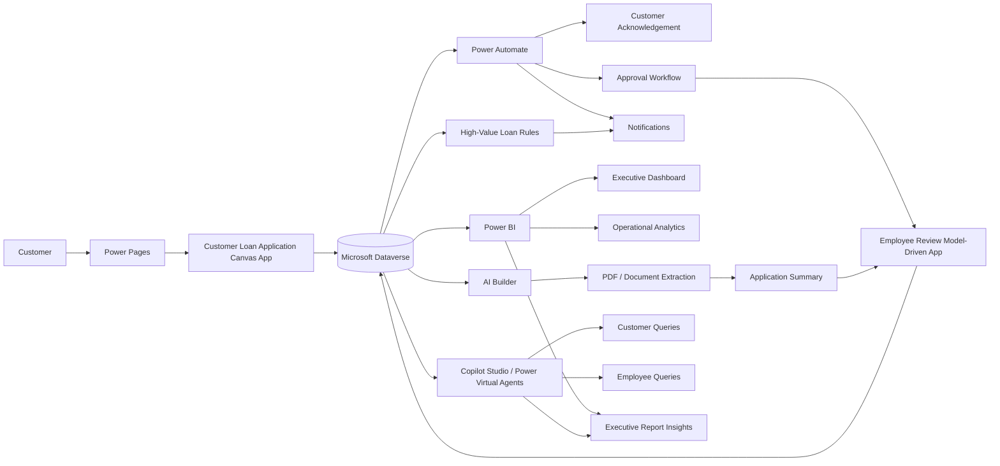
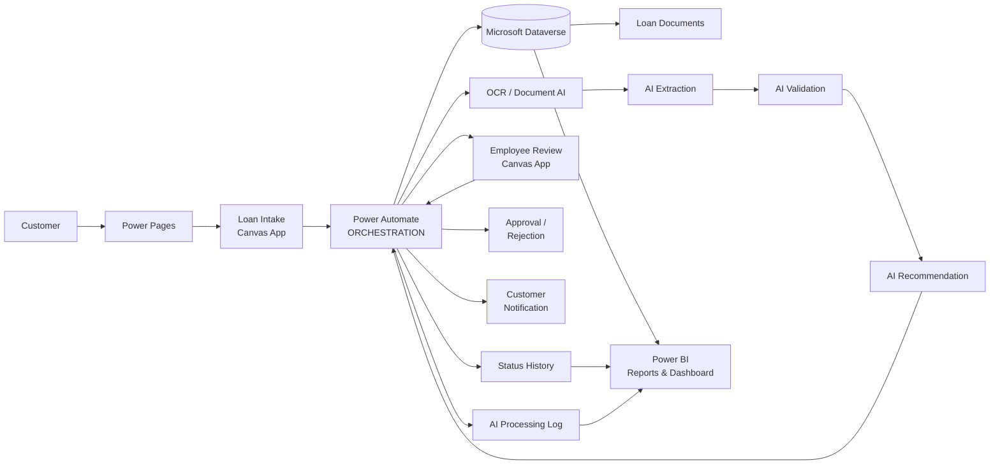
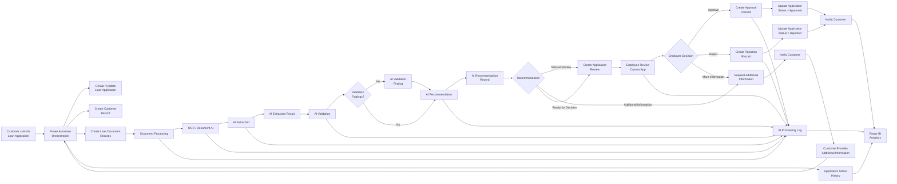
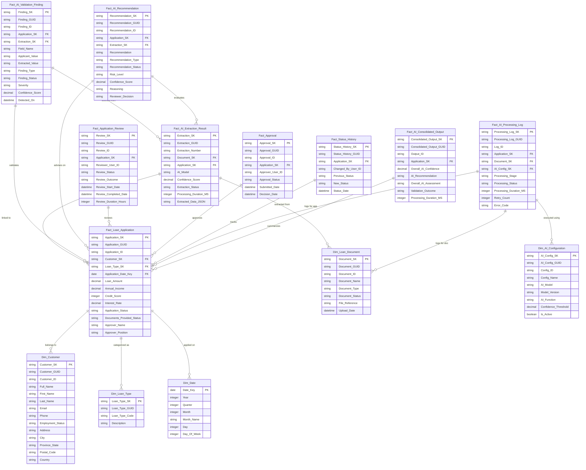

<p align="center">
  
</p


🔗 **Live Dashboard:**
[https://atsuvovor.github.io/power_bi_projects/cyber_attack_insight_dashboard.html](https://atsuvovor.github.io/power_bi_projects/cyber_attack_insight_dashboard.html)

---
## Transforming the Future of Digital Lending

At **EIPPONE**, we are redefining the lending experience through intelligent digital solutions. Our integrated platform brings together **secure online applications, automated approval workflows, real-time application tracking, and interactive business intelligence** to streamline the entire loan lifecycle.

By leveraging **Microsoft Power Platform**, organizations can improve operational efficiency, enhance customer satisfaction, and make faster, data-driven decisions.

### Business Problem

-   Manual paper-based loan applications
-   High processing time and operational effort
-   Data-entry and validation errors
-   Manual document review
-   Limited application-status visibility
-   Delayed customer communication
-   Limited operational and executive analytics

### Solution Objectives

1.  Digitize loan application intake.
2.  Centralize application information and documents in Dataverse.
3.  Validate required information before submission.
4.  Automate acknowledgement, notification, and approval workflows.
5.  Provide employees with a structured review experience.
6.  Allow customers to track application status.
7.  Provide real-time Power BI reporting.
8.  Introduce AI-assisted document extraction, summaries,
    recommendations, and conversational analytics.
9.  Identify high-value applications for enhanced monitoring.
10. Create a scalable foundation for intelligent lending operations.


## 4. Architecture Blueprint

### End-to-End Architecture



### Core Logic

``` text
Customer
   |
   v
Power Pages / Customer Application
   |
   v
Power Apps + Validation
   |
   v
Dataverse
   |
   +----> Power Automate ----> Acknowledgement / Approval / Alerts
   |
   +----> Employee Review App
   |
   +----> AI Builder ----> Extraction / Summary / Recommendation
   |
   +----> Power BI ----> Executive & Operational Analytics
   |
   +----> Copilot Studio ----> Customer & Employee Conversations
```

### System Architecture  

#### Overview

```text
                         EIPPONE LOAN PLATFORM
                                  │
                                  ▼
                           MICROSOFT POWER
                              PLATFORM
                                  │
             ┌────────────────────┼────────────────────┐
             │                    │                    │
             ▼                    ▼                    ▼
          DATAVERSE          POWER AUTOMATE       AI / DOCUMENT
        Data & Relations      Workflows            INTELLIGENCE
             │                    │                    │
             └────────────────────┼────────────────────┘
                                  │
                                  ▼
                           POWER PAGES
                       Web Portal / Experience
                                  │
              ┌───────────────────┼───────────────────┐
              │                   │                   │
              ▼                   ▼                   ▼
        CUSTOMER PORTAL     EMPLOYEE PORTAL      ANALYTICS
              │                   │                   │
              ▼                   ▼                   ▼
       Canvas App #1       Canvas App #3        Power BI
       Loan Intake         Employee Review       Reports/
                                                  Dashboard
              │                   │                   │
              └───────────────────┼───────────────────┘
                                  │
                                  ▼
                             DATAVERSE
```

#### Power Pages - External web experience/container  
```text
POWER PAGES
│
├── Customer Portal
│     ├── Loan Application Intake
│     │      └── Canvas App
│     │
│     └── Client Application View
│            └── Canvas App
│
├── Employee Portal
│     └── Employee Review
│            └── Canvas App
│
└── Analytics
      └── Power BI
             ├── Executive Dashboard
             ├── Loan Portfolio Reports
             ├── Application Analytics
             └── AI/OCR Quality Metrics

```

#### Architecture Detail

```text
                         EIPPONE LOAN PLATFORM
                                  │
                    ┌─────────────┴─────────────┐
                    │                           │
                    ▼                           ▼
              EXPERIENCE LAYER             INTELLIGENCE
                    │                           │
              POWER PAGES                  AI / OCR
                    │                           │
       ┌────────────┼────────────┐              │
       │            │            │              │
       ▼            ▼            ▼              ▼
   Customer      Employee     Analytics    Document AI
   Portal        Portal       Portal       Processing
       │            │            │              │
       ▼            ▼            ▼              │
   Canvas Apps   Canvas App   Power BI          │
       │            │            │              │
       └────────────┴────────────┴──────────────┘
                            │
                            ▼
                         DATAVERSE
                            │
       ┌────────────────────┼────────────────────┐
       │                    │                    │
       ▼                    ▼                    ▼
  Loan Operations       AI Results          Audit/History
       │                    │                    │
       ▼                    ▼                    ▼
 Applications          Extraction          Processing Log
 Customers             Validation           Status History
 Documents             Recommendation       Reviews
 Approvals                                  Approvals
                            │
                            ▼
                      POWER AUTOMATE
                       Orchestration
```


### Mermaid — Power Automate Orchestration

**Power Automate as central  orchestration engine** connecting Dataverse, document processing, AI, notifications, reviews, approvals, and audit history.


#### Overview

For your documentation, I would actually simplify the visual slightly and make **Power Automate the central orchestration engine**:



#### Power Automate Orchestration Detail




### Where Power Automate fits

Architectural definition is:

> **Power Automate — Orchestration Layer:** Coordinates application intake, Dataverse record creation and updates, document processing, AI/OCR execution, validation, recommendations, employee review, approvals, notifications, status tracking, and audit logging.

This is the version I would use in your **EIPPONE Loan Platform architecture documentation**, because it clearly separates:

* **Power Pages** → user/web experience
* **Canvas Apps** → application UI
* **Dataverse** → system of record
* **Power Automate** → orchestration
* **OCR / AI** → intelligence
* **Power BI** → analytics and reporting.

## Dataverse Architecture  
This section provides complete,  documentation for all Dataverse entities in the **EIPPONE Loan Platform** solution.

### Choices Structure
```text
Choices
│
├── Document Type
│   ├── Identification
│   ├── Proof of Address
│   ├── Proof of Income
│   ├── Employment Letter
│   ├── Bank Statement
│   ├── Tax Document
│   ├── Financial Statement
│   ├── Credit Report
│   ├── Loan Statement
│   ├── Property Document
│   ├── Purchase Agreement
│   ├── Insurance Document
│   └── Other
│
├── Document Status
│   ├── Required
│   ├── Submitted
│   ├── Under Review
│   ├── Accepted
│   ├── Rejected
│   ├── Needs Correction
│   ├── Expired
│   └── Cancelled
│
├── AI Processing Status
│   ├── Not Started
│   ├── Queued
│   ├── Processing
│   ├── Completed
│   ├── Completed with Findings
│   ├── Failed
│   ├── Requires Human Review
│   └── Skipped
│
├── Application Status
│   ├── Draft
│   ├── Submitted
│   ├── Under Review
│   ├── Pending Information
│   ├── Pending Approval
│   ├── Approved
│   ├── Rejected
│   ├── Withdrawn
│   ├── Cancelled
│   └── Completed
│
├── Review Status
│   ├── Not Started
│   ├── Assigned
│   ├── In Progress
│   ├── Pending Information
│   ├── Completed
│   ├── Escalated
│   └── Cancelled
│
├── Approval Status
│   ├── Not Started
│   ├── Pending Approval
│   ├── In Progress
│   ├── Approved
│   ├── Rejected
│   ├── Returned
│   ├── Cancelled
│   └── Expired
│
└── AI Finding Severity
    ├── Informational
    ├── Low
    ├── Medium
    ├── High
    └── Critical
```
    
### Operational Dataverse model


```text
CUSTOMER
   |
   | 1:N
   v
LOAN APPLICATION
   |
   +--------------------+
   |                    |
   | 1:N                | 1:N
   v                    v
LOAN DOCUMENT       APPLICATION REVIEW
   |
   | 1:N
   v
AI EXTRACTION RESULT


LOAN APPLICATION
   |
   +---- 1:N ---> APPROVAL
   |
   +---- 1:N ---> STATUS HISTORY
   |
   +---- 1:N ---> AI VALIDATION FINDING
   |
   +---- 1:N ---> AI RECOMMENDATION
   |
   +---- 1:N ---> AI PROCESSING LOG


LOAN TYPE
   |
   | 1:N
   v
LOAN APPLICATION              

```

### Target AI Architecture

I recommend evolving your existing platform into this architecture:

```text
                         LOAN APPLICATION DIGITALIZATION
                                      PLATFORM
                                            |
                 +--------------------------+--------------------------+
                 |                          |                          |
                 v                          v                          v
        CUSTOMER EXPERIENCE         EMPLOYEE EXPERIENCE        EXECUTIVE EXPERIENCE
                 |                          |                          |
          Power Pages                Model-Driven App             Power BI
                 |                          |                          |
                 v                          v                          v
        Customer Copilot          Employee Copilot              AI Insights
                 |                          |                          |
                 +--------------------------+--------------------------+
                                            |
                                            v
                                  COPILOT STUDIO
                                  AI ORCHESTRATION
                                            |
                    +-----------------------+-----------------------+
                    |                       |                       |
                    v                       v                       v
                Dataverse             Power Automate           Power BI
             Operational Data          Business Logic         Semantic Model
                    |                       |
                    |                       |
                    v                       v
             Loan Applications       Approval Workflow
             Documents               Notifications
             Reviews                 Alerts
             AI Results
                    |
                    v
               AI BUILDER
          Document Intelligence
                    |
                    v
          PDF / ID / Income / Tax
             / Supporting Docs
```

### Dataverse Schema 


## 1. System Architecture & Entity Relationships


---

## 2. Core Domain Data Dictionary

**Table: Customer**

**Logical Name:** `eipp_customer`

**Description:** Stores applicant profile, personal identification, contact details, and self-reported financial indicators.

| Display Name | Schema / Logical Name | Data Type | Required | Searchable | Description |
| --- | --- | --- | --- | --- | --- |
| **Address** | `eipp_address` | Multiple lines of text | No | Yes | Full street address of applicant. |
| **Annual Income** | `eipp_annualincome` | Currency | Yes | Yes | Total annual income reported. |
| **Annual Income (Base)** | `eipp_annualincome_base` | Currency | No | Yes | Base currency conversion field. |
| **City** | `eipp_city` | Single line of text | No | Yes | City location. |
| **Country** | `eipp_country` | Single line of text | No | Yes | Country of residence. |
| **Created Date** | `eipp_createddate` | Date and time | No | Yes | Record creation timestamp. |
| **Customer** | `eipp_customerid` | Unique identifier | Yes | Yes | Primary key GUID. |
| **Customer ID** | `eipp_customerid` | Autonumber | Yes | Yes | Unique reference identifier. |
| **Customer Name** *(Primary)* | `eipp_customername` | Single line of text | No | Yes | Full display name. |
| **Email** | `eipp_email` | Single line of text | No | Yes | Primary email contact. |
| **Employment Status** | `eipp_employmentstatus` | Single line of text | No | Yes | Employment condition indicator. |
| **First Name** | `eipp_firstname` | Single line of text | No | Yes | First name. |
| **Last Name** | `eipp_lastname` | Single line of text | No | Yes | Last / Surname. |
| **Modified Date** | `eipp_modifieddate` | Date and time | No | Yes | Last modified timestamp. |
| **Phone** | `eipp_phone` | Single line of text | No | Yes | Contact phone number. |
| **Postal Code** | `eipp_postalcode` | Single line of text | No | Yes | Postal / ZIP code. |
| **Province/State** | `eipp_provincestate` | Choice | No | Yes | Geographic region lookup. |

---

**Table: Loan Type**

**Logical Name:** `eipp_loantype`

**Description:** Lookup entity defining loan product types offered on the platform.

| Display Name | Schema / Logical Name | Data Type | Required | Searchable | Description |
| --- | --- | --- | --- | --- | --- |
| **Description** | `eipp_Description` | Single line of text | No | Yes | Detail on product conditions. |
| **Loan Type** | `eipp_LoanType` | Choice | No | Yes | Categorization choice. |
| **Loan Type 1ID** | `eipp_LoanTypeID` | Unique identifier | Yes | Yes | Primary key GUID. |
| **Loan Type ID** *(Primary)* | `eipp_Newcolumn` | Autonumber | Yes | Yes | Record lookup display reference. |

---

**Table: Loan Application**

**Logical Name:** `eipp_loanapplication`

**Description:** Central application entity containing submission data, terms requested, and progress indicators.

| Display Name | Schema / Logical Name | Data Type | Required | Searchable | Description |
| --- | --- | --- | --- | --- | --- |
| **Application ID** *(Primary)* | `eipp_applicationid` | Autonumber | Yes | Yes | System-assigned primary ID. |
| **Loan Application** | `eipp_loanapplicationid` | Unique identifier | Yes | Yes | Primary key GUID. |
| **Customer** | `eipp_Customer` | Lookup | Yes | Yes | Foreign key to Customer entity. |
| **Loan Type (Lookup)** | `eipp_LoanType` | Lookup | No | Yes | Reference to selected Loan Type. |
| **Loan Amount** | `eipp_loanamount` | Currency | Yes | Yes | Requested loan total. |
| **Loan Amount (Base)** | `eipp_loanamount_base` | Currency | No | Yes | Base currency conversion field. |
| **Loan Amount Term** | `eipp_leanamount_term` | Choice | No | Yes | Repayment interval classification. |
| **Loan Term** | `eipp_leanamount` | Single line of text | No | Yes | Term period text representation. |
| **Loan Term New** | `eipp_leanamountnew` | Choice | No | Yes | Standardized term selection code. |
| **Interest Rate** | `eipp_interestrate` | Decimal | No | Yes | Applied annual interest rate percentage. |
| **Application Status** | `eipp_applicationstatus` | Choice | No | Yes | Current application lifecycle state. |
| **Documents Provided** | `eipp_documentsprovided` | Choice | No | Yes | Mandatory document completion status. |
| **Applicant Signature** | `eipp_applicantsignature` | Image | No | No | Electronic signature capture file. |
| **Annual Income** | `eipp_annualincome` | Currency | No | Yes | Application-level income baseline. |
| **Credit Score** | `eipp_creditscore` | Whole number | No | Yes | Applicant bureau credit score. |
| **Approver Name** | `eipp_approvername` | Lookup | No | Yes | Assigned underwriter reference. |
| **Approver Email** | `eipp_approveremail` | Email | No | Yes | Contact email of approver. |
| **Approver Position** | `eipp_approverposition` | Single line of text | No | Yes | Approver role title. |

---

**Table: Loan Documents**

**Logical Name:** `eipp_loandocuments`

**Description:** Tracks submitted physical files, document classifications, and automated processing flags.

| Display Name | Schema / Logical Name | Data Type | Required | Searchable | Description |
| --- | --- | --- | --- | --- | --- |
| **AI Confidence** | `eipp_AIConfidence` | Decimal | No | Yes | Aggregated document extraction confidence. |
| **AI Processing Status** | `eipp_AIProcessingStatus` | Choice | Yes | Yes | Stage of AI document processing pipeline. |
| **Document ID** | `eipp_DocumentID` | Autonumber | Yes | Yes | Unique ID for document identification. |
| **Document Name** | `eipp_DocumentName` | Single line of text | No | Yes | Descriptive title of uploaded file. |
| **Document Status** | `eipp_DocumentStatus` | Choice | No | Yes | Verification status of document. |
| **Document Type** | `eipp_DocumentType` | Choice | Yes | Yes | Document taxonomy (e.g., Paystub, Passport). |
| **File** | `eipp_File` | File | Yes | No | Encrypted file storage target. |
| **Loan Application** | `eipp_LoanApplication` | Lookup | Yes | Yes | Parent Loan Application reference. |
| **Loan Document GUID** | `eipp_LoanDocumentGUID` | Unique identifier | Yes | Yes | Primary key GUID. |
| **New column** *(Primary)* | `eipp_Newcolumn` | Single line of text | No | Yes | Primary display reference column. |
| **Review Required** | `eipp_ReviewRequired` | Yes/no | Yes | Yes | Flag requesting human underwriter audit. |
| **Upload Date** | `eipp_UploadDate` | Date and time | Yes | Yes | Timestamp of document upload. |

---

## 3. Intelligence & Automation Data Dictionary

**Table: AI Configuration**

**Logical Name:** `eipp_aiconfiguration`

**Description:** Runtime registry for dynamic prompts, model parameters, target function definitions, and execution rules.

| Display Name | Schema / Logical Name | Data Type | Required | Searchable | Description |
| --- | --- | --- | --- | --- | --- |
| **AI Configuration GUID** | `eipp_AIConfigurationGUID` | Unique identifier | Yes | Yes | Primary key GUID. |
| **AI Configuration ID** *(Primary)* | `eipp_Newcolumn` | Autonumber | No | Yes | Auto-increment primary label. |
| **AI Function** | `eipp_AIFunction` | Choice | No | Yes | Automation task type classification. |
| **AI Model** | `eipp_AIModel` | Single line of text | No | Yes | Deployment model identifier (e.g., GPT-4, Document Intelligence). |
| **Confidence Threshold** | `eipp_ConfidenceThreshold` | Decimal | No | Yes | Minimum acceptable auto-approval score. |
| **Configuration Name** | `eipp_ConfigurationName` | Single line of text | No | Yes | Descriptive label of profile settings. |
| **Configuration Version** | `eipp_ConfigurationVersion` | Single line of text | No | Yes | Configuration release version tracker. |
| **Document Type** | `eipp_DocumentType` | Choice | No | Yes | Applicable document target choice. |
| **Effective From** | `eipp_EffectiveFrom` | Date and time | No | Yes | Valid date range opening. |
| **Effective To** | `eipp_EffectiveTo` | Date and time | No | Yes | Expiration timestamp for config rules. |
| **Instructions** | `eipp_Instructions` | Multiple lines of text | No | Yes | Directives / system prompts fed into models. |
| **Is Active** | `eipp_IsActive` | Yes/no | No | Yes | Active status toggle for routing logic. |
| **Model Version** | `eipp_ModelVersion` | Single line of text | No | Yes | Model engine version identifier. |
| **Notes** | `eipp_Notes` | Multiple lines of text | No | Yes | Operational context and documentation. |
| **Validation Rules** | `eipp_ValidationRules` | Multiple lines of text | No | Yes | Custom assertion expressions evaluated against inputs. |

---

**Table: AI Extraction Result**

**Logical Name:** `eipp_aiextractionresult`

**Description:** Persists output structures, raw metadata, performance scores, and error output from AI document analysis runs.

| Display Name | Schema / Logical Name | Data Type | Required | Searchable | Description |
| --- | --- | --- | --- | --- | --- |
| **AI Extraction Result GUID** | `eipp_AIExtractionResultGUID` | Unique identifier | Yes | Yes | Primary key GUID. |
| **AI Extraction Result Number** *(Primary)* | `eipp_Newcolumn` | Autonumber | No | Yes | Primary key display identifier. |
| **AI Model** | `eipp_AIModel` | Single line of text | No | Yes | Engine name used during parse. |
| **Confidence Score** | `eipp_ConfidenceScore` | Decimal | No | Yes | System extraction confidence metric. |
| **Created By** | `eipp_CreatedBy` | Lookup | No | Yes | Execution principal record owner. |
| **Created On** | `eipp_CreatedOn` | Date and time | No | Yes | Record creation timestamp. |
| **Error Message** | `eipp_ErrorMessage` | Multiple lines of text | No | Yes | Extraction stack traces or error logs. |
| **Extracted Data** | `eipp_ExtractedData` | Multiple lines of text | No | Yes | Raw JSON schema payload of findings. |
| **Extraction Date** | `eipp_ExtractionDate` | Date and time | No | Yes | Execution completion timestamp. |
| **Extraction Status** | `eipp_ExtractionStatus` | Choice | No | Yes | Outcome condition (e.g., Success, Failed). |
| **Extraction Version** | `eipp_ExtractionVersion` | Single line of text | No | Yes | Extraction schema version designation. |
| **Loan Document** | `eipp_LoanDocument` | Lookup | No | Yes | Foreign key to target document entity. |
| **Modified By** | `eipp_ModifiedBy` | Lookup | No | Yes | User or process modifying record. |
| **Modified On** | `eipp_ModifiedOn` | Date and time | No | Yes | Record last modified timestamp. |
| **Processing Duration** | `eipp_ProcessingDuration` | Whole number | No | Yes | Parse runtime duration (ms). |

---

**Table: AI Validation Finding**

**Logical Name:** `eipp_aivalidationfinding`

**Description:** Contains discrepancy checks validating extracted data against application inputs.

| Display Name | Schema / Logical Name | Data Type | Required | Searchable | Description |
| --- | --- | --- | --- | --- | --- |
| **AI Extraction Result** | `eipp_AIExtractionResult` | Lookup | No | Yes | Foreign key to source extraction result. |
| **AI Validation Finding GUID** | `eipp_AIValidationFindingGUID` | Unique identifier | Yes | Yes | Primary key GUID. |
| **AI Validation Finding ID** *(Primary)* | `eipp_Newcolumn` | Autonumber | No | Yes | Display key for identification. |
| **Applicant Value** | `eipp_ApplicantValue` | Multiple lines of text | No | Yes | Value supplied by application form. |
| **Confidence Score** | `eipp_ConfidenceScore` | Decimal | No | Yes | Confidence score of validation match. |
| **Detected On** | `eipp_DetectedOn` | Date and time | No | Yes | Mismatch detection timestamp. |
| **Extracted Value** | `eipp_ExtractedValue` | Multiple lines of text | No | Yes | Value found by AI in document. |
| **Field Name** | `eipp_FieldName` | Single line of text | No | Yes | Target attribute validated. |
| **Finding Description** | `eipp_FindingDescription` | Multiple lines of text | No | Yes | Detailed report of rule condition breach. |
| **Finding Status** | `eipp_FindingStatus` | Choice | No | Yes | Verification state (Open, Resolved, Ignored). |
| **Finding Type** | `eipp_FindingType` | Choice | No | Yes | Mismatch category indicator. |
| **Loan Application** | `eipp_LoanApplication` | Lookup | No | Yes | Parent application foreign key. |
| **Resolution Notes** | `eipp_ResolutionNotes` | Multiple lines of text | No | Yes | Manual review resolution comments. |
| **Resolved On** | `eipp_ResolvedOn` | Date and time | No | Yes | Finding resolution timestamp. |
| **Severity** | `eipp_Severity` | Choice | No | Yes | Mismatch impact degree (Low, High, Critical). |

---

**Table: AI Recommendation**

**Logical Name:** `eipp_airecommendation`

**Description:** Records machine learning recommendations, decision rationales, and human sign-off determinations.

| Display Name | Schema / Logical Name | Data Type | Required | Searchable | Description |
| --- | --- | --- | --- | --- | --- |
| **AI Extraction Result** | `eipp_AIExtractionResult` | Lookup | No | Yes | Link to document payload source. |
| **AI Recommendation GUID** | `eipp_AIRecommendationGUID` | Unique identifier | Yes | Yes | Primary key GUID. |
| **AI Recommendation ID** *(Primary)* | `eipp_Newcolumn` | Autonumber | No | Yes | Auto-increment lookup identifier. |
| **Confidence Score** | `eipp_ConfidenceScore` | Decimal | No | Yes | Statistical confidence of recommendation. |
| **Generated On** | `eipp_GeneratedOn` | Date and time | No | Yes | Timestamp decision generated. |
| **Loan Application** | `eipp_LoanApplication` | Lookup | No | Yes | Parent loan application reference. |
| **Reasoning** | `eipp_Reasoning` | Multiple lines of text | No | Yes | AI justification text output. |
| **Recommendation** | `eipp_Recommendation` | Choice | No | Yes | Primary outcome (Approve, Deny, Review). |
| **Recommendation Status** | `eipp_RecommendationStatus` | Choice | No | Yes | Lifecycle status of recommendation. |
| **Recommendation Summary** | `eipp_RecommendationSummary` | Multiple lines of text | No | Yes | Concise executive summary of result. |
| **Recommendation Type** | `eipp_RecommendationType` | Choice | No | Yes | Sub-type classification code. |
| **Reviewed On** | `eipp_ReviewedOn` | Date and time | No | Yes | Timestamp of underwriter assessment. |
| **Reviewer Comments** | `eipp_ReviewerComments` | Multiple lines of text | No | Yes | Human-in-the-loop audit notes. |
| **Reviewer Decision** | `eipp_ReviewerDecision` | Choice | No | Yes | Underwriter override/accept action. |
| **Risk Level** | `eipp_RiskLevel` | Choice | No | Yes | Calculated risk tier (Low, Medium, High). |

---

**Table: AI Consolidated Output**

**Logical Name:** `eipp_aiconsoildatedoutput`

**Description:** High-level summary entity aggregating document intelligence outputs and overall validation metrics for an application.

| Display Name | Schema / Logical Name | Data Type | Required | Searchable | Description |
| --- | --- | --- | --- | --- | --- |
| **AI Confidence Score** | `eipp_AIConfidenceScore` | Decimal | No | Yes | Consolidated confidence overall. |
| **AI Consolidated Output GUID** | `eipp_AIConsolidatedOutputGUID` | Unique identifier | Yes | Yes | Primary key GUID. |
| **AI Consolidated Output ID** *(Primary)* | `eipp_Newcolumn` | Autonumber | No | Yes | Unique lookup reference ID. |
| **AI Processing Run ID** | `eipp_AIProcessingRunID` | Lookup | No | Yes | Direct reference to execution run logs. |
| **AI Recommendation** | `eipp_AIRecommendation` | Single line of text | No | Yes | Aggregated recommendation message. |
| **Consolidated AI Result** | `eipp_ConsolidatedAIResult` | Multiple lines of text | No | Yes | Full combined output payload. |
| **Created By** | `eipp_CreatedBy` | Lookup | No | Yes | Record creator lookup. |
| **Created On** | `eipp_CreatedOn` | Date and time | No | Yes | Record creation timestamp. |
| **Key Findings** | `eipp_KeyFindings` | Multiple lines of text | No | Yes | Highlighted findings summary list. |
| **Loan Application** | `eipp_LoanApplication` | Lookup | No | Yes | Parent loan application key. |
| **Modified By** | `eipp_ModifiedBy` | Lookup | No | Yes | Last updater principal reference. |
| **Modified On** | `eipp_ModifiedOn` | Date and time | No | Yes | Record modification timestamp. |
| **Output Date** | `eipp_OutputDate` | Date and time | No | Yes | Generation timestamp. |
| **Output Version** | `eipp_OutputVersion` | Whole number | No | Yes | Incremental output version tracker. |
| **Overall AI Assessment** | `eipp_OverallAIAssessment` | Choice | No | Yes | System decision assessment. |
| **Processing Duration** | `eipp_ProcessingDuration` | Whole number | No | Yes | Total pipeline runtime (ms). |
| **Validation Outcome** | `eipp_ValidationOutcome` | Choice | No | Yes | Final validation gate status. |

---

**Table: AI Processing Log**

**Logical Name:** `eipp_aiprocessinglog`

**Description:** Low-level execution log capturing performance metrics, stage progress, errors, and retry attempts across pipelines.

| Display Name | Schema / Logical Name | Data Type | Required | Searchable | Description |
| --- | --- | --- | --- | --- | --- |
| **AI Model** | `eipp_AIModel` | Single line of text | No | Yes | Execution model identification. |
| **AI Processing Log GUID** | `eipp_AIProcessingLogGUID` | Unique identifier | Yes | Yes | Primary key GUID. |
| **AI Processing Log ID** *(Primary)* | `eipp_Newcolumn` | Autonumber | No | Yes | Auto-increment log entry reference. |
| **Error Code** | `eipp_ErrorCode` | Single line of text | No | Yes | Categorized system exception identifier. |
| **Error Message** | `eipp_ErrorMessage` | Multiple lines of text | No | Yes | Exception error details. |
| **Input Reference** | `eipp_InputReference` | Multiple lines of text | No | Yes | Pointer or key for execution input data. |
| **Loan Application** | `eipp_LoanApplication` | Lookup | No | Yes | Associated loan application key. |
| **Loan Document** | `eipp_LoanDocument` | Lookup | No | Yes | Associated target document key. |
| **Model Version** | `eipp_ModelVersion` | Single line of text | No | Yes | Deployed model release tag. |
| **Output Reference** | `eipp_OutputReference` | Multiple lines of text | No | Yes | Reference pointer for output target. |
| **Processing Duration** | `eipp_ProcessingDuration` | Whole number | No | Yes | Execution time span measurement. |
| **Processing End** | `eipp_ProcessingEnd` | Date and time | No | Yes | Pipeline end time. |
| **Processing Stage** | `eipp_ProcessingStage` | Choice | No | Yes | Active stage (Parse, Validate, Score). |
| **Processing Start** | `eipp_ProcessingStart` | Date and time | No | Yes | Pipeline start time. |
| **Processing Status** | `eipp_ProcessingStatus` | Choice | No | Yes | Execution state (Running, Failed, Pass). |
| **Retry Count** | `eipp_RetryCount` | Whole number | No | Yes | Number of re-execution attempts. |

---

## 4. Governance & Operations Data Dictionary

**Table: Application Review**

**Logical Name:** `eipp_applicationreview`

**Description:** Manages manual underwriting activities, review timelines, assignees, and decision comments.

| Display Name | Schema / Logical Name | Data Type | Required | Searchable | Description |
| --- | --- | --- | --- | --- | --- |
| **Application Review** | `eipp_ApplicationReviewId` | Unique identifier | Yes | Yes | Primary key GUID. |
| **Loan Application** | `eipp_LoanApplication` | Lookup | No | Yes | Parent loan application key. |
| **New column** *(Primary)* | `eipp_Newcolumn` | Single line of text | No | Yes | Primary display text identifier. |
| **Review Completed Date** | `eipp_ReviewCompletedDate` | Date and time | No | Yes | Audit sign-off completion date. |
| **Review ID** | `eipp_ReviewID` | Autonumber | Yes | Yes | Unique review task tracking code. |
| **Review Outcome** | `eipp_ReviewOutcome` | Choice | No | Yes | Manual review resolution decision. |
| **Review Start Date** | `eipp_ReviewStartDate` | Date and time | No | Yes | Task initiation date. |
| **Review Status** | `eipp_ReviewStatus` | Choice | No | Yes | Current task state (In Progress, Closed). |
| **Reviewer** | `eipp_Reviewer` | Lookup | No | Yes | Assigned underwriter reference. |
| **Reviewer Comments** | `eipp_ReviewerComments` | Multiple lines of text | No | Yes | Detailed underwriter notes. |

---

**Table: Application Status History**

**Logical Name:** `eipp_applicationstatushistory`

**Description:** Immutable state machine event log recording lifecycle status updates.

| Display Name | Schema / Logical Name | Data Type | Required | Searchable | Description |
| --- | --- | --- | --- | --- | --- |
| **Application Status History** | `eipp_ApplicationStatusHistory` | Unique identifier | Yes | Yes | Primary key GUID. |
| **Changed By** | `eipp_ChangedBy` | Lookup | No | Yes | Actor or service making status change. |
| **Comments** | `eipp_Comments` | Multiple lines of text | No | Yes | State transition reason or notes. |
| **Loan Application** | `eipp_LoanApplication` | Lookup | No | Yes | Related Loan Application key. |
| **New Status** | `eipp_NewStatus` | Choice | No | Yes | Target state transition output. |
| **Previous Status** | `eipp_PreviousStatus` | Choice | No | Yes | Source state transition input. |
| **Status Date** | `eipp_StatusDate` | Date and time | No | Yes | Transition timestamp. |
| **Status History ID** *(Primary)* | `eipp_Newcolumn` | Autonumber | No | Yes | Unique status event auto-number. |

---

**Table: Approval**

**Logical Name:** `eipp_approval`

**Description:** Tracks credit approval authority workflows, sign-off requests, and formal authorization events.

| Display Name | Schema / Logical Name | Data Type | Required | Searchable | Description |
| --- | --- | --- | --- | --- | --- |
| **Approval** | `eipp_ApprovalId` | Unique identifier | Yes | Yes | Primary key GUID. |
| **Approval ID** *(Primary)* | `eipp_Newcolumn` | Autonumber | No | Yes | System lookup display ID. |
| **Approval Number** | `eipp_ApprovalNumber` | Autonumber | No | Yes | Auto-sequenced approval tracking ID. |
| **Approval Status** | `eipp_ApprovalStatus` | Choice | No | Yes | Decision state (Pending, Approved). |
| **Approver** | `eipp_Approver` | Lookup | No | Yes | Approving user or group reference. |
| **Comments** | `eipp_Comments` | Multiple lines of text | No | Yes | Approver notes and conditions. |
| **Decision Date** | `eipp_DecisionDate` | Date and time | No | Yes | Sign-off or rejection timestamp. |
| **Loan Application** | `eipp_LoanApplication` | Lookup | No | Yes | Target Loan Application key. |
| **Submitted Date** | `eipp_SubmittedDate` | Date and time | No | Yes | Date approval request was issued. |

## Fabric model

```text
                         DIM_DATE
                            |
                            |
                   +--------+--------+
                   |                 |
                   v                 v
           FACT_LOAN_APPLICATION   FACT_APPROVAL
                   |
                   |
                   v
             DIM_CUSTOMER
                   |
                   |
                   v
              DIM_LOAN
                   |
                   |
                   v
              DIM_STATUS


             FACT_DOCUMENT_PROCESSING
                       |
                       +---- DIM_DOCUMENT
                       |
                       +---- DIM_DATE
                       |
                       +---- DIM_APPLICATION


                  FACT_AI_REVIEW
                       |
                       +---- DIM_APPLICATION
                       +---- DIM_AI_MODEL
                       +---- DIM_DATE


              FACT_APPLICATION_STATUS
                       |
                       +---- DIM_STATUS
                       +---- DIM_DATE
                       +---- DIM_APPLICATION

```

## Moving the Dataverse data into Fabric

We will use Fabric's Data Factory capabilities, pipelines, Dataflows Gen2, shortcuts, notebooks, or other ingestion patterns depending on the developement environment and scale.

```text
Dataverse
    |
    v
Fabric ingestion
    |
    v
Bronze/raw data
    |
    v
Transformation
    |
    v
Silver/curated data
    |
    v
Gold/star schema
    |
    v
Power BI semantic model
```


To build a clean Medallion Architecture (Bronze $\rightarrow$ Silver $\rightarrow$ Gold) in Microsoft Fabric for all 13 Dataverse tables, we need to map the source entities into a **Star Schema** optimized for Power BI reporting.

### Dataverse to Fabric Mapping Overview

* **Bronze Layer**: Direct ingestion (Delta tables) via Azure Synapse Link or Fabric Dataverse Link, retaining raw names (`eipp_customer`, `eipp_loanapplication`, etc.).
* **Silver Layer**: Cleansed, flattened, and standardized Delta tables with enterprise naming standards (renaming `eipp_Newcolumn` to meaningful keys, parsing JSON fields, and standardizing datatypes).
* **Gold Layer**: Dimensional Model (Star Schema) split into **Fact Tables** (events & measurements) and **Dimension Tables** (context & attributes).

---

# Fabric Star Schema ERD (Gold Layer)



---

# Fabric Gold Layer Data Dictionary

### Dimensions

#### 1. Table: `Dim_Customer`

**Source Table:** `eipp_customer`

**Description:** Dimension containing curated customer demographic and contact attributes.

| Column Name | Fabric Data Type | Key Type | Source Field | Description |
| --- | --- | --- | --- | --- |
| **Customer_SK** | String (Hash) | Primary Key | `SHA256(eipp_customerid)` | Surrogate key for the customer. |
| **Customer_GUID** | String | Alternate Key | `eipp_customerid` | Source Dataverse primary GUID. |
| **Customer_ID** | String | Business Key | `eipp_customerid` (Autonumber) | Business-readable Customer ID. |
| **Full_Name** | String | Attribute | `eipp_customername` | Combined display name. |
| **First_Name** | String | Attribute | `eipp_firstname` | First name. |
| **Last_Name** | String | Attribute | `eipp_lastname` | Surname. |
| **Email** | String | Attribute | `eipp_email` | Primary email. |
| **Phone** | String | Attribute | `eipp_phone` | Contact number. |
| **Employment_Status** | String | Attribute | `eipp_employmentstatus` | Employment classification. |
| **Address** | String | Attribute | `eipp_address` | Street address. |
| **City** | String | Attribute | `eipp_city` | City. |
| **Province_State** | String | Attribute | `eipp_provincestate` | State/Province. |
| **Postal_Code** | String | Attribute | `eipp_postalcode` | ZIP or Postal Code. |
| **Country** | String | Attribute | `eipp_country` | Country. |

---

#### 2. Table: `Dim_Loan_Type`

**Source Table:** `eipp_loantype`

**Description:** Product catalog dimension mapping loan categories.

| Column Name | Fabric Data Type | Key Type | Source Field | Description |
| --- | --- | --- | --- | --- |
| **Loan_Type_SK** | String (Hash) | Primary Key | `SHA256(eipp_LoanTypeID)` | Surrogate key. |
| **Loan_Type_GUID** | String | Alternate Key | `eipp_LoanTypeID` | Source GUID. |
| **Loan_Type_Code** | String | Business Key | `eipp_Newcolumn` | Primary loan type identifier. |
| **Description** | String | Attribute | `eipp_Description` | Detailed description of loan product. |

---

#### 3. Table: `Dim_Loan_Document`

**Source Table:** `eipp_loandocuments`

**Description:** Dimension containing metadata for files uploaded to the platform.

| Column Name | Fabric Data Type | Key Type | Source Field | Description |
| --- | --- | --- | --- | --- |
| **Document_SK** | String (Hash) | Primary Key | `SHA256(eipp_LoanDocumentGUID)` | Surrogate key. |
| **Document_GUID** | String | Alternate Key | `eipp_LoanDocumentGUID` | Source GUID. |
| **Document_ID** | String | Business Key | `eipp_DocumentID` | Autonumber document ID. |
| **Document_Name** | String | Attribute | `eipp_DocumentName` | File display name. |
| **Document_Type** | String | Attribute | `eipp_DocumentType` | Category (Paystub, Bank Statement, etc.). |
| **Document_Status** | String | Attribute | `eipp_DocumentStatus` | Verification status. |
| **Upload_Date** | DateTime | Attribute | `eipp_UploadDate` | File upload timestamp. |

---

#### 4. Table: `Dim_AI_Configuration`

**Source Table:** `eipp_aiconfiguration`

**Description:** Dimension capturing model versions and rules used during automated processing.

| Column Name | Fabric Data Type | Key Type | Source Field | Description |
| --- | --- | --- | --- | --- |
| **AI_Config_SK** | String (Hash) | Primary Key | `SHA256(eipp_AIConfigurationGUID)` | Surrogate key. |
| **AI_Config_GUID** | String | Alternate Key | `eipp_AIConfigurationGUID` | Source GUID. |
| **Config_ID** | String | Business Key | `eipp_Newcolumn` | Autonumber ID. |
| **Config_Name** | String | Attribute | `eipp_ConfigurationName` | Profile name. |
| **AI_Model** | String | Attribute | `eipp_AIModel` | Model deployment used. |
| **Model_Version** | String | Attribute | `eipp_ModelVersion` | Engine version string. |
| **AI_Function** | String | Attribute | `eipp_AIFunction` | Action category (Extract, Validate). |
| **Confidence_Threshold** | Decimal | Attribute | `eipp_ConfidenceThreshold` | Minimum required score. |
| **Is_Active** | Boolean | Attribute | `eipp_IsActive` | Flag indicating active deployment. |

---

### Facts

#### 5. Table: `Fact_Loan_Application`

**Source Table:** `eipp_loanapplication`

**Description:** Central fact entity containing quantitative measurements and statuses for all loan requests.

| Column Name | Fabric Data Type | Key Type | Source Field | Description |
| --- | --- | --- | --- | --- |
| **Application_SK** | String (Hash) | Primary Key | `SHA256(eipp_loanapplicationid)` | Surrogate key for loan application. |
| **Application_GUID** | String | Alternate Key | `eipp_loanapplicationid` | Dataverse primary GUID. |
| **Application_ID** | String | Business Key | `eipp_applicationid` | Business-readable Application ID. |
| **Customer_SK** | String (Hash) | Foreign Key | `eipp_Customer` | FK to `Dim_Customer`. |
| **Loan_Type_SK** | String (Hash) | Foreign Key | `eipp_LoanType` | FK to `Dim_Loan_Type`. |
| **Application_Date_Key** | Date | Foreign Key | Formatted `CreatedOn` | FK to `Dim_Date`. |
| **Loan_Amount** | Decimal | Measure | `eipp_loanamount` | Requested loan principal amount. |
| **Annual_Income** | Decimal | Measure | `eipp_annualincome` | Applicant annual income. |
| **Credit_Score** | Integer | Measure | `eipp_creditscore` | Credit bureau score. |
| **Interest_Rate** | Decimal | Measure | `eipp_interestrate` | Target interest rate percentage. |
| **Application_Status** | String | Degenerate Dim | `eipp_applicationstatus` | Current process state. |
| **Documents_Provided** | String | Degenerate Dim | `eipp_documentsprovided` | Completion status flag. |

---

#### 6. Table: `Fact_AI_Extraction_Result`

**Source Table:** `eipp_aiextractionresult`

**Description:** Fact table storing individual AI document extraction metrics and payloads.

| Column Name | Fabric Data Type | Key Type | Source Field | Description |
| --- | --- | --- | --- | --- |
| **Extraction_SK** | String (Hash) | Primary Key | `SHA256(eipp_AIExtractionResultGUID)` | Primary key surrogate. |
| **Extraction_GUID** | String | Alternate Key | `eipp_AIExtractionResultGUID` | Source GUID. |
| **Extraction_Number** | String | Business Key | `eipp_Newcolumn` | Autonumber ID. |
| **Document_SK** | String (Hash) | Foreign Key | `eipp_LoanDocument` | FK to `Dim_Loan_Document`. |
| **Application_SK** | String (Hash) | Foreign Key | Lookup to Application | FK to `Fact_Loan_Application`. |
| **AI_Model** | String | Degenerate Dim | `eipp_AIModel` | Model engine executed. |
| **Confidence_Score** | Decimal | Measure | `eipp_ConfidenceScore` | Calculated confidence rating. |
| **Extraction_Status** | String | Degenerate Dim | `eipp_ExtractionStatus` | Processing outcome state. |
| **Processing_Duration_MS** | Integer | Measure | `eipp_ProcessingDuration` | Execution time in milliseconds. |
| **Extracted_Data_JSON** | String | Attribute | `eipp_ExtractedData` | Parsed JSON text output. |

---

#### 7. Table: `Fact_AI_Validation_Finding`

**Source Table:** `eipp_aivalidationfinding`

**Description:** Fact table measuring discrepancies detected during automated data verification.

| Column Name | Fabric Data Type | Key Type | Source Field | Description |
| --- | --- | --- | --- | --- |
| **Finding_SK** | String (Hash) | Primary Key | `SHA256(eipp_AIValidationFindingGUID)` | Surrogate key. |
| **Finding_GUID** | String | Alternate Key | `eipp_AIValidationFindingGUID` | Source GUID. |
| **Finding_ID** | String | Business Key | `eipp_Newcolumn` | Autonumber finding ID. |
| **Application_SK** | String (Hash) | Foreign Key | `eipp_LoanApplication` | FK to `Fact_Loan_Application`. |
| **Extraction_SK** | String (Hash) | Foreign Key | `eipp_AIExtractionResult` | FK to `Fact_AI_Extraction_Result`. |
| **Field_Name** | String | Degenerate Dim | `eipp_FieldName` | Targeted data attribute name. |
| **Applicant_Value** | String | Attribute | `eipp_ApplicantValue` | Self-reported value. |
| **Extracted_Value** | String | Attribute | `eipp_ExtractedValue` | Value parsed by AI. |
| **Finding_Type** | String | Degenerate Dim | `eipp_FindingType` | Category of discrepancy. |
| **Severity** | String | Degenerate Dim | `eipp_Severity` | Risk impact severity (High, Low). |
| **Confidence_Score** | Decimal | Measure | `eipp_ConfidenceScore` | AI validation confidence score. |
| **Detected_On** | DateTime | Attribute | `eipp_DetectedOn` | Detection timestamp. |

---

#### 8. Table: `Fact_AI_Recommendation`

**Source Table:** `eipp_airecommendation`

**Description:** Fact table recording AI-generated credit risk advice and human override decisions.

| Column Name | Fabric Data Type | Key Type | Source Field | Description |
| --- | --- | --- | --- | --- |
| **Recommendation_SK** | String (Hash) | Primary Key | `SHA256(eipp_AIRecommendationGUID)` | Surrogate key. |
| **Recommendation_GUID** | String | Alternate Key | `eipp_AIRecommendationGUID` | Source GUID. |
| **Recommendation_ID** | String | Business Key | `eipp_Newcolumn` | Autonumber ID. |
| **Application_SK** | String (Hash) | Foreign Key | `eipp_LoanApplication` | FK to `Fact_Loan_Application`. |
| **Extraction_SK** | String (Hash) | Foreign Key | `eipp_AIExtractionResult` | FK to `Fact_AI_Extraction_Result`. |
| **Recommendation** | String | Degenerate Dim | `eipp_Recommendation` | Machine decision advice. |
| **Risk_Level** | String | Degenerate Dim | `eipp_RiskLevel` | Assessed risk tier. |
| **Confidence_Score** | Decimal | Measure | `eipp_ConfidenceScore` | Recommendation certainty score. |
| **Reasoning** | String | Attribute | `eipp_Reasoning` | AI explanation context. |
| **Reviewer_Decision** | String | Degenerate Dim | `eipp_ReviewerDecision` | Final underwriter override choice. |

---

#### 9. Table: `Fact_AI_Consolidated_Output`

**Source Table:** `eipp_aiconsoildatedoutput`

**Description:** High-level executive summary fact table for platform-wide AI performance reporting.

| Column Name | Fabric Data Type | Key Type | Source Field | Description |
| --- | --- | --- | --- | --- |
| **Consolidated_Output_SK** | String (Hash) | Primary Key | `SHA256(eipp_AIConsolidatedOutputGUID)` | Surrogate key. |
| **Output_ID** | String | Business Key | `eipp_Newcolumn` | Autonumber ID. |
| **Application_SK** | String (Hash) | Foreign Key | `eipp_LoanApplication` | FK to `Fact_Loan_Application`. |
| **Overall_AI_Confidence** | Decimal | Measure | `eipp_AIConfidenceScore` | Unified confidence score. |
| **AI_Recommendation** | String | Degenerate Dim | `eipp_AIRecommendation` | Consolidated recommendation text. |
| **Overall_AI_Assessment** | String | Degenerate Dim | `eipp_OverallAIAssessment` | System risk verdict. |
| **Validation_Outcome** | String | Degenerate Dim | `eipp_ValidationOutcome` | Gate verification status. |
| **Processing_Duration_MS** | Integer | Measure | `eipp_ProcessingDuration` | End-to-end AI latency. |

---

#### 10. Table: `Fact_AI_Processing_Log`

**Source Table:** `eipp_aiprocessinglog`

**Description:** Technical operational metrics table for tracking pipeline performance and latency.

| Column Name | Fabric Data Type | Key Type | Source Field | Description |
| --- | --- | --- | --- | --- |
| **Processing_Log_SK** | String (Hash) | Primary Key | `SHA256(eipp_AIProcessingLogGUID)` | Surrogate key. |
| **Log_ID** | String | Business Key | `eipp_Newcolumn` | Autonumber log ID. |
| **Application_SK** | String (Hash) | Foreign Key | `eipp_LoanApplication` | FK to `Fact_Loan_Application`. |
| **Document_SK** | String (Hash) | Foreign Key | `eipp_LoanDocument` | FK to `Dim_Loan_Document`. |
| **AI_Config_SK** | String (Hash) | Foreign Key | Lookup derived via Model | FK to `Dim_AI_Configuration`. |
| **Processing_Stage** | String | Degenerate Dim | `eipp_ProcessingStage` | Active process step. |
| **Processing_Status** | String | Degenerate Dim | `eipp_ProcessingStatus` | Run status (Success, Fail). |
| **Processing_Duration_MS** | Integer | Measure | `eipp_ProcessingDuration` | Stage execution duration. |
| **Retry_Count** | Integer | Measure | `eipp_RetryCount` | Number of execution retries. |
| **Error_Code** | String | Degenerate Dim | `eipp_ErrorCode` | Platform error classification. |

---

#### 11. Table: `Fact_Application_Review`

**Source Table:** `eipp_applicationreview`

**Description:** Operational fact entity measuring manual underwriting timelines and outcomes.

| Column Name | Fabric Data Type | Key Type | Source Field | Description |
| --- | --- | --- | --- | --- |
| **Review_SK** | String (Hash) | Primary Key | `SHA256(eipp_ApplicationReviewId)` | Surrogate key. |
| **Review_ID** | String | Business Key | `eipp_ReviewID` | Autonumber review ID. |
| **Application_SK** | String (Hash) | Foreign Key | `eipp_LoanApplication` | FK to `Fact_Loan_Application`. |
| **Reviewer_User_ID** | String | Attribute | `eipp_Reviewer` | System user reference. |
| **Review_Status** | String | Degenerate Dim | `eipp_ReviewStatus` | Underwriter review stage. |
| **Review_Outcome** | String | Degenerate Dim | `eipp_ReviewOutcome` | Underwriter decision verdict. |
| **Review_Start_Date** | DateTime | Attribute | `eipp_ReviewStartDate` | Review start timestamp. |
| **Review_Completed_Date** | DateTime | Attribute | `eipp_ReviewCompletedDate` | Review end timestamp. |
| **Review_Duration_Hours** | Integer | Measure | Calculated field | Duration from start to finish. |

---

#### 12. Table: `Fact_Approval`

**Source Table:** `eipp_approval`

**Description:** Tracks sign-off events and authorization decisions.

| Column Name | Fabric Data Type | Key Type | Source Field | Description |
| --- | --- | --- | --- | --- |
| **Approval_SK** | String (Hash) | Primary Key | `SHA256(eipp_ApprovalId)` | Surrogate key. |
| **Approval_ID** | String | Business Key | `eipp_Newcolumn` | Autonumber display ID. |
| **Application_SK** | String (Hash) | Foreign Key | `eipp_LoanApplication` | FK to `Fact_Loan_Application`. |
| **Approver_User_ID** | String | Attribute | `eipp_Approver` | Approver identity key. |
| **Approval_Status** | String | Degenerate Dim | `eipp_ApprovalStatus` | Current sign-off state. |
| **Submitted_Date** | DateTime | Attribute | `eipp_SubmittedDate` | Date requested. |
| **Decision_Date** | DateTime | Attribute | `eipp_DecisionDate` | Date approved/rejected. |

---

#### 13. Table: `Fact_Status_History`

**Source Table:** `eipp_applicationstatushistory`

**Description:** Audit log capturing status duration and workflow progression.

| Column Name | Fabric Data Type | Key Type | Source Field | Description |
| --- | --- | --- | --- | --- |
| **Status_History_SK** | String (Hash) | Primary Key | `SHA256(eipp_ApplicationStatusHistory)` | Surrogate key. |
| **Application_SK** | String (Hash) | Foreign Key | `eipp_LoanApplication` | FK to `Fact_Loan_Application`. |
| **Changed_By_User_ID** | String | Attribute | `eipp_ChangedBy` | User issuing change. |
| **Previous_Status** | String | Degenerate Dim | `eipp_PreviousStatus` | Originating status state. |
| **New_Status** | String | Degenerate Dim | `eipp_NewStatus` | Destination status state. |
| **Status_Date** | DateTime | Attribute | `eipp_StatusDate` | Transition timestamp. |

---

Now we To implement this directly into your **Fabric Lakehouse / Warehouse** via PySpark or SQL, we will generate surrogate keys (`_SK`) using `SHA256()` hashing during the Medallion Silver-to-Gold PySpark transformations.

Here is the complete architecture, implementation guide, and PySpark codebase to transform the Silver Medallion Delta tables into Gold Star Schema tables in Microsoft Fabric.

---

## 1. Fabric Architectural Separation: Lakehouse vs. Warehouse

To follow Microsoft Fabric best practices, the responsibilities between the **Lakehouse** and the **Warehouse** are divided as follows:

| Layer / Component | Implemented In | Technology | Responsibility |
| --- | --- | --- | --- |
| **Bronze Layer** | Fabric Lakehouse | Shortcut / Data Pipeline | Raw Dataverse Delta tables synced automatically via Azure Synapse Link or Fabric Dataverse Link. |
| **Silver Layer** | Fabric Lakehouse | PySpark (Notebooks) | Data cleaning, type standardization, parsing raw JSON fields, and resolving Dataverse option sets. |
| **Gold Layer (Tables)** | Fabric Lakehouse | PySpark (Notebooks) | Dimension and Fact generation using surrogate key hashing (`SHA256`), written out as Delta tables. |
| **Gold Layer (Serving)** | Fabric Warehouse | T-SQL Direct Lake | Exposing Gold Delta tables via SQL Views/Tables to power the **Power BI Direct Lake** semantic model. |

---

## 2. Step-by-Step Implementation Guide

### Step 1: Ingest Dataverse Data (Bronze)

1. Open your Fabric Workspace and create a **Lakehouse** named `lh_loan_platform`.
2. Link your Dataverse environment using **Fabric Dataverse Link** (or Azure Synapse Link).
3. Confirm that all 13 Dataverse tables appear in your Lakehouse under `Tables/` (e.g., `eipp_customer`, `eipp_loanapplication`).

### Step 2: Create the PySpark Notebook for Gold Transformations

1. In your workspace, click **+ New item** $\rightarrow$ **Notebook**.
2. Attach the notebook to your `lh_loan_platform` Lakehouse.
3. Paste and execute the PySpark script below. This will read Silver/Bronze Delta tables, apply transformations and hashing, and save the Gold Star Schema tables as Delta format into `lh_loan_platform`.

### Step 3: Expose Gold Tables in Fabric Warehouse / Direct Lake

1. Create a **Warehouse** (or use the Lakehouse **SQL Analytics Endpoint**) named `wh_loan_analytics`.
2. In the Warehouse, create SQL Views over the Lakehouse Gold Delta tables using standard T-SQL:
```sql
CREATE VIEW dbo.Dim_Customer AS 
SELECT * FROM lh_loan_platform.dbo.Dim_Customer;

```


3. Open the **Model View** inside the SQL Analytics Endpoint or Warehouse.
4. Establish relationships between Facts and Dimensions (e.g., `Fact_Loan_Application.Customer_SK` $\rightarrow$ `Dim_Customer.Customer_SK`).
5. Select **New Semantic Model** to publish the Direct Lake model directly into Power BI.

---

## 3. Production PySpark Script: Silver to Gold Transformations

Paste the following code into a single Fabric Notebook cell or break it across notebook cells to execute the full transformation pipeline.

```python
from pyspark.sql import SparkSession
from pyspark.sql.functions import (
    col, sha2, concat_ws, coalesce, lit, to_date, to_timestamp, 
    date_format, year, quarter, month, monthname, dayofmonth, dayofweek
)

# Initialize Spark Session
spark = SparkSession.builder.appName("Dataverse_Silver_To_Gold").getOrCreate()

# Base Path Configuration
LAKEHOUSE_DB = "lh_loan_platform"

# Helper Function: Read Source Delta Tables
def read_silver(table_name):
    return spark.read.table(f"{LAKEHOUSE_DB}.{table_name}")

# Helper Function: Write Gold Delta Tables
def write_gold(df, target_table_name):
    (
        df.write
        .format("delta")
        .mode("overwrite")
        .option("overwriteSchema", "true")
        .saveAsTable(f"{LAKEHOUSE_DB}.{target_table_name}")
    )
    print(f"Successfully written: {target_table_name}")

# ==========================================
# 1. DIMENSION TRANSFORMATIONS
# ==========================================

# Dim_Customer
df_customer_src = read_silver("eipp_customer")
dim_customer = df_customer_src.select(
    sha2(col("eipp_customerid"), 256).alias("Customer_SK"),
    col("eipp_customerid").alias("Customer_GUID"),
    col("eipp_customerid").alias("Customer_ID"),
    col("eipp_customername").alias("Full_Name"),
    col("eipp_firstname").alias("First_Name"),
    col("eipp_lastname").alias("Last_Name"),
    col("eipp_email").alias("Email"),
    col("eipp_phone").alias("Phone"),
    col("eipp_employmentstatus").alias("Employment_Status"),
    col("eipp_address").alias("Address"),
    col("eipp_city").alias("City"),
    col("eipp_provincestate").alias("Province_State"),
    col("eipp_postalcode").alias("Postal_Code"),
    col("eipp_country").alias("Country")
)
write_gold(dim_customer, "Dim_Customer")

# Dim_Loan_Type
df_loantype_src = read_silver("eipp_loantype")
dim_loan_type = df_loantype_src.select(
    sha2(col("eipp_LoanTypeID"), 256).alias("Loan_Type_SK"),
    col("eipp_LoanTypeID").alias("Loan_Type_GUID"),
    col("eipp_Newcolumn").alias("Loan_Type_Code"),
    col("eipp_Description").alias("Description")
)
write_gold(dim_loan_type, "Dim_Loan_Type")

# Dim_Loan_Document
df_loandoc_src = read_silver("eipp_loandocuments")
dim_loan_document = df_loandoc_src.select(
    sha2(col("eipp_LoanDocumentGUID"), 256).alias("Document_SK"),
    col("eipp_LoanDocumentGUID").alias("Document_GUID"),
    col("eipp_DocumentID").alias("Document_ID"),
    col("eipp_DocumentName").alias("Document_Name"),
    col("eipp_DocumentType").alias("Document_Type"),
    col("eipp_DocumentStatus").alias("Document_Status"),
    to_timestamp(col("eipp_UploadDate")).alias("Upload_Date")
)
write_gold(dim_loan_document, "Dim_Loan_Document")

# Dim_AI_Configuration
df_aiconfig_src = read_silver("eipp_aiconfiguration")
dim_ai_config = df_aiconfig_src.select(
    sha2(col("eipp_AIConfigurationGUID"), 256).alias("AI_Config_SK"),
    col("eipp_AIConfigurationGUID").alias("AI_Config_GUID"),
    col("eipp_Newcolumn").alias("Config_ID"),
    col("eipp_ConfigurationName").alias("Config_Name"),
    col("eipp_AIModel").alias("AI_Model"),
    col("eipp_ModelVersion").alias("Model_Version"),
    col("eipp_AIFunction").alias("AI_Function"),
    col("eipp_ConfidenceThreshold").cast("decimal(5,4)").alias("Confidence_Threshold"),
    col("eipp_IsActive").alias("Is_Active")
)
write_gold(dim_ai_config, "Dim_AI_Configuration")

# Dim_Date Generator
df_app_dates = read_silver("eipp_loanapplication").select(to_date(col("eipp_createddate")).alias("Date")).distinct()
dim_date = df_app_dates.filter(col("Date").isNotNull()).select(
    col("Date").alias("Date_Key"),
    year(col("Date")).alias("Year"),
    quarter(col("Date")).alias("Quarter"),
    month(col("Date")).alias("Month"),
    date_format(col("Date"), "MMMM").alias("Month_Name"),
    dayofmonth(col("Date")).alias("Day"),
    dayofweek(col("Date")).alias("Day_Of_Week")
)
write_gold(dim_date, "Dim_Date")

# ==========================================
# 2. FACT TRANSFORMATIONS
# ==========================================

# Fact_Loan_Application
df_app_src = read_silver("eipp_loanapplication")
fact_loan_application = df_app_src.select(
    sha2(col("eipp_loanapplicationid"), 256).alias("Application_SK"),
    col("eipp_loanapplicationid").alias("Application_GUID"),
    col("eipp_applicationid").alias("Application_ID"),
    sha2(col("eipp_Customer"), 256).alias("Customer_SK"),
    sha2(col("eipp_LoanType"), 256).alias("Loan_Type_SK"),
    to_date(col("eipp_createddate")).alias("Application_Date_Key"),
    col("eipp_loanamount").cast("decimal(18,2)").alias("Loan_Amount"),
    col("eipp_annualincome").cast("decimal(18,2)").alias("Annual_Income"),
    col("eipp_creditscore").cast("integer").alias("Credit_Score"),
    col("eipp_interestrate").cast("decimal(5,4)").alias("Interest_Rate"),
    col("eipp_applicationstatus").alias("Application_Status"),
    col("eipp_documentsprovided").alias("Documents_Provided_Status"),
    col("eipp_approvername").alias("Approver_Name"),
    col("eipp_approverposition").alias("Approver_Position")
)
write_gold(fact_loan_application, "Fact_Loan_Application")

# Fact_AI_Extraction_Result
df_ext_src = read_silver("eipp_aiextractionresult")
fact_ai_extraction = df_ext_src.select(
    sha2(col("eipp_AIExtractionResultGUID"), 256).alias("Extraction_SK"),
    col("eipp_AIExtractionResultGUID").alias("Extraction_GUID"),
    col("eipp_Newcolumn").alias("Extraction_Number"),
    sha2(col("eipp_LoanDocument"), 256).alias("Document_SK"),
    sha2(col("eipp_LoanApplication"), 256).alias("Application_SK"),
    col("eipp_AIModel").alias("AI_Model"),
    col("eipp_ConfidenceScore").cast("decimal(5,4)").alias("Confidence_Score"),
    col("eipp_ExtractionStatus").alias("Extraction_Status"),
    col("eipp_ProcessingDuration").cast("integer").alias("Processing_Duration_MS"),
    col("eipp_ExtractedData").alias("Extracted_Data_JSON")
)
write_gold(fact_ai_extraction, "Fact_AI_Extraction_Result")

# Fact_AI_Validation_Finding
df_val_src = read_silver("eipp_aivalidationfinding")
fact_ai_validation = df_val_src.select(
    sha2(col("eipp_AIValidationFindingGUID"), 256).alias("Finding_SK"),
    col("eipp_AIValidationFindingGUID").alias("Finding_GUID"),
    col("eipp_Newcolumn").alias("Finding_ID"),
    sha2(col("eipp_LoanApplication"), 256).alias("Application_SK"),
    sha2(col("eipp_AIExtractionResult"), 256).alias("Extraction_SK"),
    col("eipp_FieldName").alias("Field_Name"),
    col("eipp_ApplicantValue").alias("Applicant_Value"),
    col("eipp_ExtractedValue").alias("Extracted_Value"),
    col("eipp_FindingType").alias("Finding_Type"),
    col("eipp_FindingStatus").alias("Finding_Status"),
    col("eipp_Severity").alias("Severity"),
    col("eipp_ConfidenceScore").cast("decimal(5,4)").alias("Confidence_Score"),
    to_timestamp(col("eipp_DetectedOn")).alias("Detected_On")
)
write_gold(fact_ai_validation, "Fact_AI_Validation_Finding")

# Fact_AI_Recommendation
df_rec_src = read_silver("eipp_airecommendation")
fact_ai_recommendation = df_rec_src.select(
    sha2(col("eipp_AIRecommendationGUID"), 256).alias("Recommendation_SK"),
    col("eipp_AIRecommendationGUID").alias("Recommendation_GUID"),
    col("eipp_Newcolumn").alias("Recommendation_ID"),
    sha2(col("eipp_LoanApplication"), 256).alias("Application_SK"),
    sha2(col("eipp_AIExtractionResult"), 256).alias("Extraction_SK"),
    col("eipp_Recommendation").alias("Recommendation"),
    col("eipp_RecommendationType").alias("Recommendation_Type"),
    col("eipp_RecommendationStatus").alias("Recommendation_Status"),
    col("eipp_RiskLevel").alias("Risk_Level"),
    col("eipp_ConfidenceScore").cast("decimal(5,4)").alias("Confidence_Score"),
    col("eipp_Reasoning").alias("Reasoning"),
    col("eipp_ReviewerDecision").alias("Reviewer_Decision")
)
write_gold(fact_ai_recommendation, "Fact_AI_Recommendation")

# Fact_AI_Consolidated_Output
df_con_src = read_silver("eipp_aiconsoildatedoutput")
fact_ai_consolidated = df_con_src.select(
    sha2(col("eipp_AIConsolidatedOutputGUID"), 256).alias("Consolidated_Output_SK"),
    col("eipp_AIConsolidatedOutputGUID").alias("Consolidated_Output_GUID"),
    col("eipp_Newcolumn").alias("Output_ID"),
    sha2(col("eipp_LoanApplication"), 256).alias("Application_SK"),
    col("eipp_AIConfidenceScore").cast("decimal(5,4)").alias("Overall_AI_Confidence"),
    col("eipp_AIRecommendation").alias("AI_Recommendation"),
    col("eipp_OverallAIAssessment").alias("Overall_AI_Assessment"),
    col("eipp_ValidationOutcome").alias("Validation_Outcome"),
    col("eipp_ProcessingDuration").cast("integer").alias("Processing_Duration_MS")
)
write_gold(fact_ai_consolidated, "Fact_AI_Consolidated_Output")

# Fact_AI_Processing_Log
df_log_src = read_silver("eipp_aiprocessinglog")
fact_ai_processing_log = df_log_src.select(
    sha2(col("eipp_AIProcessingLogGUID"), 256).alias("Processing_Log_SK"),
    col("eipp_AIProcessingLogGUID").alias("Processing_Log_GUID"),
    col("eipp_Newcolumn").alias("Log_ID"),
    sha2(col("eipp_LoanApplication"), 256).alias("Application_SK"),
    sha2(col("eipp_LoanDocument"), 256).alias("Document_SK"),
    sha2(col("eipp_AIModel"), 256).alias("AI_Config_SK"), # Surrogate link to config
    col("eipp_ProcessingStage").alias("Processing_Stage"),
    col("eipp_ProcessingStatus").alias("Processing_Status"),
    col("eipp_ProcessingDuration").cast("integer").alias("Processing_Duration_MS"),
    col("eipp_RetryCount").cast("integer").alias("Retry_Count"),
    col("eipp_ErrorCode").alias("Error_Code")
)
write_gold(fact_ai_processing_log, "Fact_AI_Processing_Log")

# Fact_Application_Review
df_rev_src = read_silver("eipp_applicationreview")
fact_application_review = df_rev_src.select(
    sha2(col("eipp_ApplicationReviewId"), 256).alias("Review_SK"),
    col("eipp_ApplicationReviewId").alias("Review_GUID"),
    col("eipp_ReviewID").alias("Review_ID"),
    sha2(col("eipp_LoanApplication"), 256).alias("Application_SK"),
    col("eipp_Reviewer").alias("Reviewer_User_ID"),
    col("eipp_ReviewStatus").alias("Review_Status"),
    col("eipp_ReviewOutcome").alias("Review_Outcome"),
    to_timestamp(col("eipp_ReviewStartDate")).alias("Review_Start_Date"),
    to_timestamp(col("eipp_ReviewCompletedDate")).alias("Review_Completed_Date")
)
write_gold(fact_application_review, "Fact_Application_Review")

# Fact_Approval
df_appr_src = read_silver("eipp_approval")
fact_approval = df_appr_src.select(
    sha2(col("eipp_ApprovalId"), 256).alias("Approval_SK"),
    col("eipp_ApprovalId").alias("Approval_GUID"),
    col("eipp_Newcolumn").alias("Approval_ID"),
    sha2(col("eipp_LoanApplication"), 256).alias("Application_SK"),
    col("eipp_Approver").alias("Approver_User_ID"),
    col("eipp_ApprovalStatus").alias("Approval_Status"),
    to_timestamp(col("eipp_SubmittedDate")).alias("Submitted_Date"),
    to_timestamp(col("eipp_DecisionDate")).alias("Decision_Date")
)
write_gold(fact_approval, "Fact_Approval")

# Fact_Status_History
df_hist_src = read_silver("eipp_applicationstatushistory")
fact_status_history = df_hist_src.select(
    sha2(col("eipp_ApplicationStatusHistory"), 256).alias("Status_History_SK"),
    col("eipp_ApplicationStatusHistory").alias("Status_History_GUID"),
    sha2(col("eipp_LoanApplication"), 256).alias("Application_SK"),
    col("eipp_ChangedBy").alias("Changed_By_User_ID"),
    col("eipp_PreviousStatus").alias("Previous_Status"),
    col("eipp_NewStatus").alias("New_Status"),
    to_timestamp(col("eipp_StatusDate")).alias("Status_Date")
)
write_gold(fact_status_history, "Fact_Status_History")

print("--- All Gold Medallion Transformations Completed Successfully ---")

```

## Loan Digitalization Platfrom Analytics - Power BI Report

Here are the complete **DAX measure formulas** and **layout mockups** for all ** suggested report pages** to complete the  Loan Analytics suite.

---

# Page 1: Credit Risk & Applicant Profile

### DAX Measures

```dax
// 1. Average Requested Loan Amount
Avg Requested Amount = 
AVERAGE(cr_application[Amount])

// 2. Average Stated Income
Avg Stated Income = 
AVERAGE(cr_application[StatedIncome])

// 3. Debt-to-Income (DTI) Ratio %
Avg Debt to Income Ratio = 
AVERAGEX(
    FILTER(cr_application, NOT(ISBLANK(cr_application[StatedIncome])) && cr_application[StatedIncome] > 0),
    DIVIDE(cr_application[MonthlyDebt], cr_application[StatedIncome] / 12, 0)
)

// 4. Income Tier Category (Calculated Column)
Income Tier = 
SWITCH(
    TRUE(),
    cr_application[StatedIncome] < 50000, "< $50k",
    cr_application[StatedIncome] <= 100000, "$50k - $100k",
    cr_application[StatedIncome] <= 150000, "$100k - $150k",
    "> $150k"
)

```

### Layout Mockup

```text
+---------------------------------------------------------------------------------------------------+
|  [KPI: Avg Requested Amount]  [KPI: Avg Stated Income]  [KPI: Avg DTI Ratio]  [KPI: Avg Credit Score] |
+---------------------------------------------------------------+-----------------------------------+
|  Loan Volume & Approval Rate by Income Tier                   | Demographic Breakdown             |
|  (Clustered Column & Line Chart)                              | (Donut Chart)                     |
|   - X-Axis: Income Tier (<$50k, $50k-$100k, etc.)             |   - Slice: Employment Status      |
|   - Columns: Application Count                                |     (Employed, Self-Employed, etc.)|
|   - Line: Approval Rate %                                     |   - Metric: Volume & Approval %   |
+---------------------------------------------------------------+-----------------------------------+
|  Applicant Risk Matrix                                                                            |
|  (Scatter Plot: X = Stated Income, Y = Requested Amount, Size = Approval Rate %, Legend = Status) |
+---------------------------------------------------------------------------------------------------+

```

---

# Page 2: Operational Bottlenecks & Review Velocity

### DAX Measures

```dax
// 1. Average Time to Decision (Days)
Avg Decision Time (Days) = 
AVERAGEX(
    FILTER(cr_application, NOT(ISBLANK(cr_application[DecisionDate]))),
    DATEDIFF(cr_application[SubmissionDate], cr_application[DecisionDate], DAY)
)

// 2. Under Review Backlog Count
Under Review Backlog = 
CALCULATE(
    COUNT(cr_application[ApplicationID]),
    cr_application[Status] = "Under Review"
)

// 3. SLA Compliance % (Threshold: <= 5 Days)
SLA Compliance % = 
DIVIDE(
    CALCULATE(
        COUNT(cr_application[ApplicationID]),
        FILTER(
            cr_application,
            NOT(ISBLANK(cr_application[DecisionDate])) &&
            DATEDIFF(cr_application[SubmissionDate], cr_application[DecisionDate], DAY) <= 5
        )
    ),
    CALCULATE(
        COUNT(cr_application[ApplicationID]),
        NOT(ISBLANK(cr_application[DecisionDate]))
    ),
    0
)

// 4. Application Age Bucket (Calculated Column)
Application Age Group = 
VAR DaysPending = DATEDIFF(cr_application[SubmissionDate], TODAY(), DAY)
RETURN
SWITCH(
    TRUE(),
    ISBLANK(cr_application[DecisionDate]) && DaysPending <= 3, "0 - 3 Days",
    ISBLANK(cr_application[DecisionDate]) && DaysPending <= 7, "4 - 7 Days",
    ISBLANK(cr_application[DecisionDate]) && DaysPending <= 14, "8 - 14 Days",
    ISBLANK(cr_application[DecisionDate]), "15+ Days (Overdue)",
    "Decisioned"
)

```

### Layout Mockup

```text
+---------------------------------------------------------------------------------------------------+
|  [KPI: Avg Decision Time (Days)]  [KPI: SLA Compliance %]  [KPI: Under Review Backlog] [KPI: Overdue] |
+---------------------------------------------------------------+-----------------------------------+
|  Stage Duration Funnel                                        | Underwriter Workload              |
|  (Funnel Visual)                                              | (Stacked Bar Chart)               |
|   - Submitted -> Document Verified -> Under Review -> Decision|   - Y-Axis: Underwriter Name      |
|   - Value: Average Days Spent per Stage                       |   - Bars: Under Review vs Decisioned  |
+---------------------------------------------------------------+-----------------------------------+
|  Aging Backlog Matrix                                                                             |
|  (Matrix Table)                                                                                   |
|   - Rows: Loan Type | Columns: Application Age Group (0-3 days, 4-7 days, 8-14 days, 15+ days)      |
|   - Values: Count of Applications & Sum of Loan Amount                                            |
+---------------------------------------------------------------------------------------------------+

```

---

# Page 3: High-Value Loan & Concentration Portfolio

### DAX Measures

```dax
// Dynamic Dynamic High-Value Threshold (Uses Configuration Table or Parameter)
High Value Threshold = 150000 

// 1. High-Value Application Count
High Value App Count = 
CALCULATE(
    COUNT(cr_application[ApplicationID]),
    cr_application[Amount] >= [High Value Threshold]
)

// 2. Total High-Value Exposure ($)
High Value Total Exposure = 
CALCULATE(
    SUM(cr_application[Amount]),
    cr_application[Amount] >= [High Value Threshold]
)

// 3. Pending High-Value Exposure ($)
High Value Pending Exposure = 
CALCULATE(
    SUM(cr_application[Amount]),
    cr_application[Amount] >= [High Value Threshold],
    cr_application[Status] = "Under Review"
)

// 4. High-Value Approval Rate %
High Value Approval Rate % = 
DIVIDE(
    CALCULATE(COUNT(cr_application[ApplicationID]), cr_application[Amount] >= [High Value Threshold], cr_application[Status] = "Approved"),
    CALCULATE(COUNT(cr_application[ApplicationID]), cr_application[Amount] >= [High Value Threshold], cr_application[Status] IN {"Approved", "Rejected"}),
    0
)

```

### Layout Mockup

```text
+---------------------------------------------------------------------------------------------------+
|  [KPI: Total HV Exposure ($)] [KPI: Pending HV Exposure ($)] [KPI: HV App Count] [KPI: HV Approval %]|
+---------------------------------------------------------------+-----------------------------------+
|  High-Value Exposure Concentration                            | High-Value Approval Trend Line    |
|  (Treemap Visual)                                             | (Line Chart)                      |
|   - Grouping: Loan Type & Loan Term                           |   - X-Axis: Month                 |
|   - Size: Sum of Requested Loan Amount                        |   - Lines: Approved Amount ($) vs |
|   - Color: Status                                             |            Rejected Amount ($)    |
+---------------------------------------------------------------+-----------------------------------+
|  Top Pending High-Value Applications Review Queue                                                 |
|  (Table Visual with Conditional Formatting on High Confidence/Missing Docs)                       |
|   - Columns: App ID | Applicant Name | Requested Amount | Income | Confidence Score | Assigned To |
+---------------------------------------------------------------------------------------------------+

```

---

# Page 4: AI Extraction & Governance

### DAX Measures

```dax
// 1. Average OCR Confidence Score %
Avg Extraction Confidence = 
AVERAGE(cr_loandocument[ConfidenceScore])

// 2. Straight-Through Processing (STP) Rate % (Processed without manual override)
STP Rate % = 
DIVIDE(
    CALCULATE(
        COUNT(cr_loandocument[DocumentID]),
        cr_loandocument[ExtractionStatus] = "Processed",
        cr_loandocument[ConfidenceScore] >= 0.85
    ),
    COUNT(cr_loandocument[DocumentID]),
    0
)

// 3. Missing / Failed Document Count
Failed Document Verification Count = 
CALCULATE(
    COUNT(cr_loandocument[DocumentID]),
    cr_loandocument[ExtractionStatus] IN {"Failed", "Requires Manual Review"}
)

```

### Layout Mockup

```text
+---------------------------------------------------------------------------------------------------+
|  [KPI: Avg OCR Confidence Score] [KPI: STP Rate %] [KPI: Failed Verifications] [KPI: Total Processed]|
+---------------------------------------------------------------+-----------------------------------+
|  Confidence Score Distribution by Document Type               | Extraction Exception Categories   |
|  (Column Chart)                                               | (Donut Chart)                     |
|   - X-Axis: Document Type (ID, Tax Return, Income Proof, etc.)|   - Slices: Low Confidence,       |
|   - Y-Axis: Average Confidence Score %                        |     Missing Required Field,       |
|   - Threshold Line at 85% Target                              |     Unreadable Document/Scan      |
+---------------------------------------------------------------+-----------------------------------+
|  AI Recommendation vs. Human Decision Alignment                                                   |
|  (Matrix / Cross-Tab)                                                                             |
|   - Rows: AI Suggested Decision (Approve / Review / Reject)                                       |
|   - Columns: Actual Human Decision (Approved / Rejected)                                          |
|   - Values: Application Count (Highlights model alignment vs. human overrides)                     |
+---------------------------------------------------------------------------------------------------+

```

---

# Page 5: Executive Portfolio Yield & Forecast

### DAX Measures

```dax
// 1. Total Originated Portfolio Value ($)
Total Originated Value = 
CALCULATE(
    SUM(cr_application[Amount]),
    cr_application[Status] = "Approved"
)

// 2. Projected Annual Interest Yield ($)
Projected Interest Yield = 
SUMX(
    FILTER(cr_application, cr_application[Status] = "Approved"),
    cr_application[Amount] * cr_application[InterestRate]
)

// 3. Month-over-Month Growth %
MoM Volume Growth % = 
VAR CurrentMonth = [Total Applications]
VAR PriorMonth = 
    CALCULATE(
        [Total Applications],
        DATEADD('Calendar'[Date], -1, MONTH)
    )
RETURN
DIVIDE(CurrentMonth - PriorMonth, PriorMonth, 0)

```

### Layout Mockup

```text
+---------------------------------------------------------------------------------------------------+
|  [KPI: Originated Value ($)]  [KPI: Projected Yield ($)]  [KPI: MoM Growth %]  [KPI: Rejection Rate %]|
+---------------------------------------------------------------+-----------------------------------+
|  Origination Trend: Actual vs. Forecast                       | Yield Analysis by Loan Type       |
|  (Combo Line and Clustered Column Chart)                      | (Waterfall Chart)                 |
|   - Columns: Monthly Approved Volume ($)                      |   - Categories: Auto, Business,   |
|   - Line: Forecasted Origination Target                       |     Home, Personal                |
|                                                               |   - Values: Projected Interest    |
+---------------------------------------------------------------+-----------------------------------+
|  Rejection Cause Decomposition                                                                    |
|  (Decomposition Tree)                                                                             |
|   - Root: Rejected Applications Count                             |                                   |
|   - Branch 1: Loan Type -> Branch 2: Primary Rejection Factor (DTI, Income Unverified, High Risk) |
+---------------------------------------------------------------------------------------------------+

```
