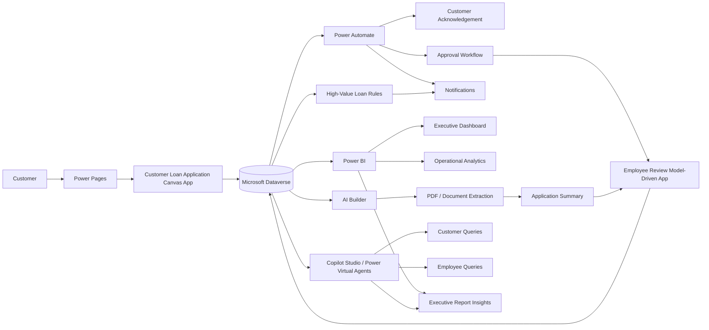
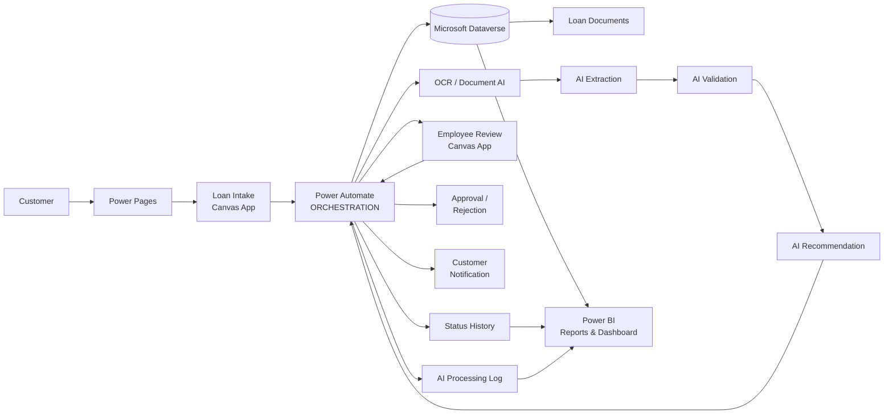
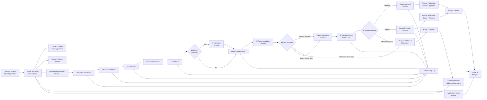

<p align="center">
  
</p


🔗 **Live Dashboard:**
[https://atsuvovor.github.io/power_bi_projects/cyber_attack_insight_dashboard.html](https://atsuvovor.github.io/power_bi_projects/cyber_attack_insight_dashboard.html)

---
## Transforming the Future of Digital Lending

At **EIPPONE**, we are redefining the lending experience through intelligent digital solutions. Our integrated platform brings together **secure online applications, automated approval workflows, real-time application tracking, and interactive business intelligence** to streamline the entire loan lifecycle.

By leveraging **Microsoft Power Platform**, organizations can improve operational efficiency, enhance customer satisfaction, and make faster, data-driven decisions.

### Business Problem

-   Manual paper-based loan applications
-   High processing time and operational effort
-   Data-entry and validation errors
-   Manual document review
-   Limited application-status visibility
-   Delayed customer communication
-   Limited operational and executive analytics

### Solution Objectives

1.  Digitize loan application intake.
2.  Centralize application information and documents in Dataverse.
3.  Validate required information before submission.
4.  Automate acknowledgement, notification, and approval workflows.
5.  Provide employees with a structured review experience.
6.  Allow customers to track application status.
7.  Provide real-time Power BI reporting.
8.  Introduce AI-assisted document extraction, summaries,
    recommendations, and conversational analytics.
9.  Identify high-value applications for enhanced monitoring.
10. Create a scalable foundation for intelligent lending operations.


## 4. Architecture Blueprint

### End-to-End Architecture



### Core Logic

``` text
Customer
   |
   v
Power Pages / Customer Application
   |
   v
Power Apps + Validation
   |
   v
Dataverse
   |
   +----> Power Automate ----> Acknowledgement / Approval / Alerts
   |
   +----> Employee Review App
   |
   +----> AI Builder ----> Extraction / Summary / Recommendation
   |
   +----> Power BI ----> Executive & Operational Analytics
   |
   +----> Copilot Studio ----> Customer & Employee Conversations
```

### System Architecture  

#### Overview

```text
                         EIPPONE LOAN PLATFORM
                                  │
                                  ▼
                           MICROSOFT POWER
                              PLATFORM
                                  │
             ┌────────────────────┼────────────────────┐
             │                    │                    │
             ▼                    ▼                    ▼
          DATAVERSE          POWER AUTOMATE       AI / DOCUMENT
        Data & Relations      Workflows            INTELLIGENCE
             │                    │                    │
             └────────────────────┼────────────────────┘
                                  │
                                  ▼
                           POWER PAGES
                       Web Portal / Experience
                                  │
              ┌───────────────────┼───────────────────┐
              │                   │                   │
              ▼                   ▼                   ▼
        CUSTOMER PORTAL     EMPLOYEE PORTAL      ANALYTICS
              │                   │                   │
              ▼                   ▼                   ▼
       Canvas App #1       Canvas App #3        Power BI
       Loan Intake         Employee Review       Reports/
                                                  Dashboard
              │                   │                   │
              └───────────────────┼───────────────────┘
                                  │
                                  ▼
                             DATAVERSE
```

#### Power Pages - External web experience/container  
```text
POWER PAGES
│
├── Customer Portal
│     ├── Loan Application Intake
│     │      └── Canvas App
│     │
│     └── Client Application View
│            └── Canvas App
│
├── Employee Portal
│     └── Employee Review
│            └── Canvas App
│
└── Analytics
      └── Power BI
             ├── Executive Dashboard
             ├── Loan Portfolio Reports
             ├── Application Analytics
             └── AI/OCR Quality Metrics

```

#### Architecture Detail

```text
                         EIPPONE LOAN PLATFORM
                                  │
                    ┌─────────────┴─────────────┐
                    │                           │
                    ▼                           ▼
              EXPERIENCE LAYER             INTELLIGENCE
                    │                           │
              POWER PAGES                  AI / OCR
                    │                           │
       ┌────────────┼────────────┐              │
       │            │            │              │
       ▼            ▼            ▼              ▼
   Customer      Employee     Analytics    Document AI
   Portal        Portal       Portal       Processing
       │            │            │              │
       ▼            ▼            ▼              │
   Canvas Apps   Canvas App   Power BI          │
       │            │            │              │
       └────────────┴────────────┴──────────────┘
                            │
                            ▼
                         DATAVERSE
                            │
       ┌────────────────────┼────────────────────┐
       │                    │                    │
       ▼                    ▼                    ▼
  Loan Operations       AI Results          Audit/History
       │                    │                    │
       ▼                    ▼                    ▼
 Applications          Extraction          Processing Log
 Customers             Validation           Status History
 Documents             Recommendation       Reviews
 Approvals                                  Approvals
                            │
                            ▼
                      POWER AUTOMATE
                       Orchestration
```


### Mermaid — Power Automate Orchestration

**Power Automate as central  orchestration engine** connecting Dataverse, document processing, AI, notifications, reviews, approvals, and audit history.


#### Overview

For your documentation, I would actually simplify the visual slightly and make **Power Automate the central orchestration engine**:



#### Power Automate Orchestration Detail




### Where Power Automate fits

The clean architectural definition is:

> **Power Automate — Orchestration Layer:** Coordinates application intake, Dataverse record creation and updates, document processing, AI/OCR execution, validation, recommendations, employee review, approvals, notifications, status tracking, and audit logging.

This is the version I would use in your **EIPPONE Loan Platform architecture documentation**, because it clearly separates:

* **Power Pages** → user/web experience
* **Canvas Apps** → application UI
* **Dataverse** → system of record
* **Power Automate** → orchestration
* **OCR / AI** → intelligence
* **Power BI** → analytics and reporting.
